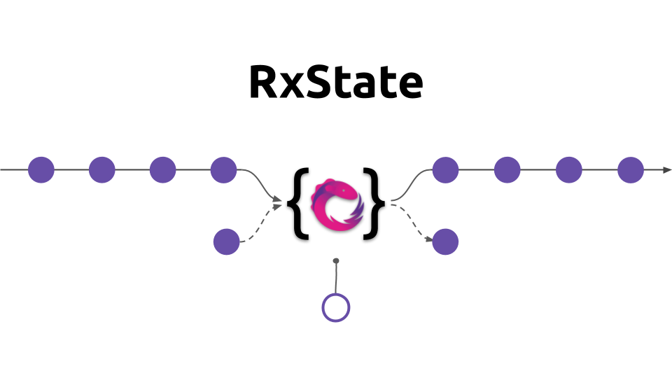

# RxAngular 

RxAngular offers a comprehensive toolset for handling fully reactive Angular applications with the main focus on runtime
performance and template rendering.

RxAngular is divided into the following independent packages:

    

    State
    
    

    

    Template
    
    

Used together, you get a powerful tool for developing high-performance angular applications with or without NgZone.

This repository holds a set of helpers to create **fully reactive** as well as **fully zone-less** applications.

## Homepage

https://rx-angular.github.io/rx-angular/#/

## Packages

Find details in the linked readme files below for installation and setup instructions, examples and resources.

### [📦@rx-angular/state](https://github.com/rx-angular/rx-angular/tree/master/libs/state/README.md) - Reactive Component State-Management  

**Description:**  
RxState is a light-weight, flexible tool to manage component state in efficiently. 
It ships with a light weight state management, RxJS operators and transformation helpers.  

**Setup:**
- `npm install --save @rx-angular/state`  
- `yarn add @rx-angular/state`  

**Features:**  
- Reactive Component-State [RxState<T>](https://rx-angular.github.io/rx-angular/#/web/state/api/rx-state)
- State as a signal [.$](https://rx-angular.github.io/rx-angular/#/web/state/api/rx-state?id=-state-observable).pipe(map(s => s.prop))
  - Imperative style 
    - [.set](https://rx-angular.github.io/rx-angular/#/web/state/api/rx-state?id=set)('prop', (oldState, value) => oldState.prop + value) 
    - [.get](https://rx-angular.github.io/rx-angular/#/web/state/api/rx-state?id=get)('prop') 
  - Reactive style  
    - [.connect](https://rx-angular.github.io/rx-angular/#/web/state/api/rx-state?id=connect)('prop', prop$) 
    - [.select](https://rx-angular.github.io/rx-angular/#/web/state/api/rx-state?id=select)(map(s => s.prop))
  - Reactive side-effects [.hold](https://rx-angular.github.io/rx-angular/#/web/state/api/rx-state?id=hold)(trigger$, effectFn)
  - Configurable composition [.setAccumulator](https://rx-angular.github.io/rx-angular/#/web/state/api/rx-state?id=setaccumulator)(trigger$, effectFn)
- Reactive state management operators
  - o$.pipe([select](https://rx-angular.github.io/rx-angular/#/web/state/api/rxjs-operators?id=select)(map(s => s.prop))]() 
  - o$.pipe([selectSlice](https://rx-angular.github.io/rx-angular/#/web/state/api/rxjs-operators?id=selectSlices)(\['prop'\], {prop})]() 
  - o$.pipe([stateful](https://rx-angular.github.io/rx-angular/#/web/state/api/rxjs-operators?id=stateful)() 
  - o$.pipe([distinctUntilSomeChanged](https://rx-angular.github.io/rx-angular/#/web/state/api/rxjs-operators?id=distinctuntilsomechanged)(\['prop'\], {list})]() 
- Imperative state transformation helper
  - Array []: [insert](https://rx-angular.github.io/rx-angular/#/web/state/api/transformation-helpers?id=insert) , [remove](https://rx-angular.github.io/rx-angular/#/web/state/api/transformation-helpers?id=remove) , [toDictionary](https://rx-angular.github.io/rx-angular/#/web/state/api/transformation-helpers?id=toDictionary), [update](https://rx-angular.github.io/rx-angular/#/web/state/api/transformation-helpers?id=update) 
  - Object {}: [deleteProp](https://rx-angular.github.io/rx-angular/#/web/state/api/transformation-helpers?id=deleteProp) , [dictionaryToArray](https://rx-angular.github.io/rx-angular/#/web/state/api/transformation-helpers?id=dictianaryToArray), [patch](https://rx-angular.github.io/rx-angular/#/web/state/api/transformation-helpers?id=patch) , [setProp]() , [toggle]() 
   
### [📦@rx-angular/template](https://github.com/rx-angular/rx-angular/tree/master/libs/template/README.md) - High-Performance Reactive Rendering

**Description:**  
RxState is a light-weight, flexible tool to manage component state in efficiently. 
It ships with a light weight state management, RxJS operators and transformation helpers.  

**Setup:**  
- `npm install --save @rx-angular/template`  
- `yarn add @rx-angular/template`  

**Features:**    
