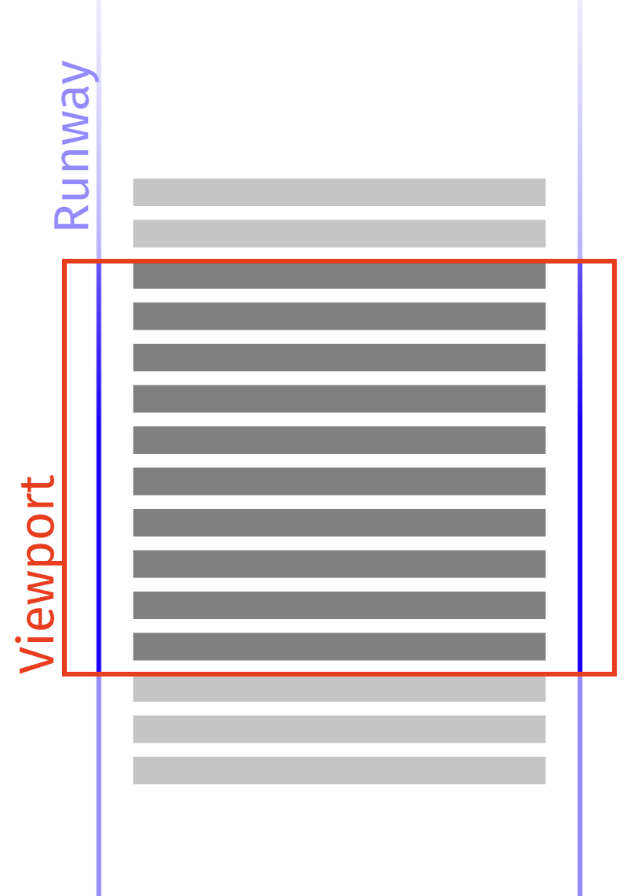

# How RxAngular virtual scrolling works

`@rx-angular/template/virtual-scrolling` solves the same problem as
[`@angular/cdk/scrolling`](https://material.angular.io/cdk/scrolling/overview), rendering
only the visible slice of a large list, but it takes the layout burden onto itself to
keep rendering off the browser's critical path. This page explains the *why* and *how*.
For the API, see the [`RxVirtualFor`](./reference/rx-virtual-for.md),
[viewport](./reference/rx-virtual-scroll-viewport.md), and
[strategy](./reference/rx-virtual-scroll-strategies.md) references. For the general
scheduling model, see [Concurrent scheduling & the frame budget](../../concepts/E5-concurrent-scheduling.md).

The technique mirrors the one Twitter uses, described in detail by Surma in
[The complexities of an infinite scroller](https://developer.chrome.com/blog/infinite-scroller/):

> "Each recycling of a DOM element would normally relayout the entire runway which would
> bring us well below our target of 60 frames per second. To avoid this, we are taking the
> burden of layout onto ourselves and use absolutely positioned elements with transforms."

## Comparison with Angular CDK

| | RxAngular | Angular CDK |
| --- | --- | --- |
| NgZone agnostic | ✅ | ❌ |
| layout containment | ✅ | ✅ |
| layout technique | absolutely position each view | transform a container within the viewport |
| scheduling technique | [`RenderStrategies`](../../concepts/E5-concurrent-scheduling.md) | `requestAnimationFrame` |
| renderCallback | ✅ | ❌ |
| SSR | ⚠ to be tested | ✅ |
| define visible view buffer | configurable views in scroll direction and opposite | configurable buffer in px |
| trackBy | ✅ | ✅ |
| view recycling | ✅ | ✅ |
| scrollToIndex | ✅ | ✅ |
| FixedSizeStrategy | ✅ | ✅ |
| AutosizeStrategy | ✅ | ⚠️ scrollToIndex & scrolledIndex not supported |
| DynamicSizeStrategy | ✅ | ❌ |
| viewport orientation | ❌ planned | ✅ |
| separate viewport and scrolling element | ❌ planned | ✅ |
| tombstone / placeholder views | ❌ planned | ❌ |

## Layout technique

The biggest difference between the two implementations is the layout technique. Two tasks
must be handled when laying out a virtual viewport: sizing the scrollable area (the
*runway*), and keeping the visible part (the *viewport*) in sync with the user's scroll
position.




_screenshot from https://developer.chrome.com/blog/infinite-scroller/_

### Runway sizing

The Angular CDK sizes its runway by adjusting the `height` of a spacer `div`. This creates
one large layer that pressures device memory (the layers tool estimates ~5GB for a
runway of 30,000 items) and, because changing `height` forces a layout, does more work
than necessary.

RxAngular instead uses a 1px × 1px element with a `transform` to simulate the runway
height, so the DOM element never grows beyond its boundaries. Because the runway is sized
with `transform` rather than `height`, resizing it costs the browser no layout work.

### Maintaining the viewport

The CDK positions list items *relatively* inside a separate container that is only as
large as its contents, then moves the whole container with a CSS `transform` on scroll:

```ts
// @angular/cdk fixed-size-virtual-scroll.ts
this._viewport.setRenderedContentOffset(this._itemSize * newRange.start);
```

RxAngular calculates the position of each item within the runway and absolutely positions
each one individually with a `transform`. Doing the layout manually removes the need for
the browser to lay out items within the viewport, especially for updates, moves, and
insertions from cache. It also enables features such as `scrollToIndex` and emitting a
`scrolledIndex` for the autosize strategy, because the cached positions are known.

## Scheduling

The other major difference is the scheduling technique used to apply DOM updates.

The CDK uses `requestAnimationFrame` both to debounce view-range calculation *and* to run
change detection, evaluating all changes synchronously in the same animation-frame
callback. On weak devices or with heavy list items this concentrates a lot of work into a
single task, producing long tasks and scroll stutter.

RxAngular coalesces scroll events before calculating view-range changes. The
FixedSizeVirtualScrollStrategy coalesces using `requestAnimationFrame`; the Autosize and
DynamicSize strategies coalesce using a microtask (`unpatchedMicroTask()`) for lower
latency. Change detection itself runs through a **configurable**
strategy, by default the `normal` concurrent strategy. The concurrent strategies batch
work into pieces that fit a frame budget (60fps by default): view-range changes become
individual insert / move / update / delete / position work packages, processed one at a
time while respecting the budget. This keeps long tasks to a minimum and keeps scrolling
smooth. See [Concurrent scheduling & the frame budget](../../concepts/E5-concurrent-scheduling.md)
for the underlying model.

## Performance comparison

Recordings come from the [demo application](https://hoebbelsb.github.io/rxa-virtual-scroll/),
which renders lists of 30,000 items. The benchmarked scenario is long-distance scrolling
via the scroll bar, which stresses the virtual scroller the most.

**System setup:** `Pop!_OS 22.04 LTS`, Chromium 112, Intel Core i7-9750H.

- **Fixed size.** Without throttling both do fine, but the CDK already shows partially
  presented frames and longer JavaScript tasks. Under 4× CPU throttling the CDK struggles
  to keep a reasonable frame rate (tasks up to ~160ms); the RxAngular fixed-size strategy
  stays above 30fps.
- **Dynamic size** (compared against the CDK experimental autosize strategy, its closest
  counterpart). The CDK experimental strategy does not emit the current scroll index and
  has no working `scrollToIndex`; the RxAngular dynamic-size strategy does both, and holds
  ~45fps without throttling and above 30fps under 4× throttling.
- **Autosize.** The RxAngular autosize strategy holds a stable 60fps without throttling.
  Each inserted view causes a forced reflow (it reads its dimensions immediately), but the
  layout work goes through the RxAngular scheduler queue, which keeps the frame budget.
  Nodes visited once are cached, so re-scrolling a path is as fast as the fixed/dynamic
  strategies. Even under 4× throttling users never hit long tasks.

Video: [layout technique comparison](https://user-images.githubusercontent.com/4904455/231340169-f65efe6c-863d-49e8-9f4f-183bb38e1b2a.mp4).

## Planned improvements

The package currently supports only vertical scrolling. Planned work includes horizontal
and grid orientations ([#1554](https://github.com/rx-angular/rx-angular/issues/1554),
[#1550](https://github.com/rx-angular/rx-angular/issues/1550)), separating the viewport
from the scrolling element ([#1555](https://github.com/rx-angular/rx-angular/issues/1555)),
and tombstone / placeholder views
([#1556](https://github.com/rx-angular/rx-angular/issues/1556)).

## Referenced by

- [`RxVirtualFor` reference](./reference/rx-virtual-for.md)
- [`RxVirtualScrollViewport` reference](./reference/rx-virtual-scroll-viewport.md)
- [Virtual scroll strategies reference](./reference/rx-virtual-scroll-strategies.md)
- [Virtual scroll recipes](./how-to/virtual-scroll-recipes.md)

## See also

- Concept: [Concurrent scheduling & the frame budget](../../concepts/E5-concurrent-scheduling.md)
- [The complexities of an infinite scroller (Surma)](https://developer.chrome.com/blog/infinite-scroller/)
