import ReactPlayer from 'react-player';
import Tabs from '@theme/Tabs';
import TabItem from '@theme/TabItem';

A high performance virtual scrolling implementation for Angular.

Instead of rendering every item provided, `rxVirtualFor` only renders what is currently visible to the user, thus providing
excellent runtime performance for huge sets of data.

The technique to render items is comparable to the one used by twitter and
explained in great detail by @DasSurma in his blog post about the
[complexities of infinite scrollers](https://developer.chrome.com/blog/infinite-scroller/).

"Each recycling of a DOM element would normally relayout the entire runway which would bring us well below our target
of 60 frames per second. To avoid this, we are taking the burden of layout onto ourselves and use absolutely positioned
elements with transforms." [(@DasSurma)](https://twitter.com/dassurma)

:::note

This package is currently experimental, the public API can potentially change

:::

The `@rx-angular/template/experimental/virtual-scrolling` package is a performance focused alternative to the official `@angular/cdk/scrolling`.

The API is heavily inspired by the CDK implementation and is divided into multiple core components which have to be glued together:

- `RxVirtualViewRepeater`, implemented by `RxVirtualFor`
- `RxVirtualScrollViewport`, implemented by `RxVirtualScrollViewportComponent`
- `RxVirtualScrollStrategy`, implemented by `AutosizeVirtualScrollStrategy`, `FixedSizeVirtualScrollStrategy` & `DynamicSizeVirtualScrollStrategy`

See the [comparison section](#comparison-with-angular-cdk) for an in-depth comparison to the Angular CDK implementation.

## Usage

<Tabs>

  <TabItem value="signals" label="Usage with signals">

```html title="list.component.html"
<rx-virtual-scroll-viewport [itemSize]="50">
  <div *rxVirtualFor="let movie of movies;">
    <div><strong>{{ movie.name }}</strong></div>
    <div>{{ movie.id }}</div>
    <div>{{ movie.description }}</div>
  </div>
</rx-virtual-scroll-viewport>
```

```typescript title="src/list.component.ts"
import {
  FixedSizeVirtualScrollStrategy, // choose any strategy you like
  RxVirtualScrollViewportComponent,
  RxVirtualFor,
} from '@rx-angular/template/experimental/virtual-scrolling';

@Component({
  standalone: true,
  imports: [RxVirtualFor, RxVirtualScrollViewportComponent, FixedSizeVirtualScrollStrategy],
})
export class ListComponent {
  movies: Signal<Movie[]> = this.movieService.fetchMovies();
}
```

  </TabItem>

  <TabItem value="obs" label="Usage with observables">

```html title="list.component.html"
<rx-virtual-scroll-viewport [itemSize]="50">
  <div *rxVirtualFor="let movie of movies$;">
    <div><strong>{{ movie.name }}</strong></div>
    <div>{{ movie.id }}</div>
    <div>{{ movie.description }}</div>
  </div>
</rx-virtual-scroll-viewport>
```

```typescript title="src/list.component.ts"
import {
  FixedSizeVirtualScrollStrategy, // choose any strategy you like
  RxVirtualScrollViewportComponent,
  RxVirtualFor,
} from '@rx-angular/template/experimental/virtual-scrolling';

@Component({
  standalone: true,
  imports: [RxVirtualFor, RxVirtualScrollViewportComponent, FixedSizeVirtualScrollStrategy],
})
export class ListComponent {
  movies$: Observable<Movie[]> = this.movieService.fetchMovies();
}
```

  </TabItem>

  <TabItem value="static" label="Usage with static values">

```html title="list.component.html"
<rx-virtual-scroll-viewport [itemSize]="50">
  <div *rxVirtualFor="let movie of movies;">
    <div><strong>{{ movie.name }}</strong></div>
    <div>{{ movie.id }}</div>
    <div>{{ movie.description }}</div>
  </div>
</rx-virtual-scroll-viewport>

<!-- unwrapping a signal also counts as static value -->
<rx-virtual-scroll-viewport [itemSize]="50">
  <div *rxVirtualFor="let movie of moviesSignal();">
    <div><strong>{{ movie.name }}</strong></div>
    <div>{{ movie.id }}</div>
    <div>{{ movie.description }}</div>
  </div>
</rx-virtual-scroll-viewport>
```

```typescript title="src/list.component.ts"
import {
  FixedSizeVirtualScrollStrategy, // choose any strategy you like
  RxVirtualScrollViewportComponent,
  RxVirtualFor,
} from '@rx-angular/template/experimental/virtual-scrolling';

@Component({
  standalone: true,
  imports: [RxVirtualFor, RxVirtualScrollViewportComponent, FixedSizeVirtualScrollStrategy],
})
export class ListComponent {
  moviesSignal: Signal<Movie[]> = this.movieService.fetchMovies();
  movies: Movie[];

  constructor() {
    this.movieService.fetchMovies$().subscribe((result) => (this.movies = result.data));
  }
}
```

  </TabItem>

</Tabs>

```ts
import {
  FixedSizeVirtualScrollStrategy, // choose any strategy you like
  RxVirtualScrollViewportComponent,
  RxVirtualFor,
} from '@rx-angular/template/experimental/virtual-scrolling';

@Component({
  standalone: true,
  imports: [RxVirtualFor, RxVirtualScrollViewportComponent, FixedSizeVirtualScrollStrategy],
})
export class MyComponent {}
```

```html
<rx-virtual-scroll-viewport [itemSize]="50">
  <div *rxVirtualFor="let hero of heroes$;">
    <div>
      <div><strong>{{ hero.name }}</strong></div>
      <div>{{ hero.id }}</div>
      <div>{{ hero.description }}</div>
    </div>
  </div>
</rx-virtual-scroll-viewport>
```

## Demo

Check out the [Demo Application](https://hoebbelsb.github.io/rxa-virtual-scroll/). You can play around with
all pre-packaged ScrollStrategies as well as control the majority of inputs.

## Concepts

- [Local variables](../concepts/local-variables.md)
- [Handling view and content queries](../performance-issues/handling-view-and-content-queries.md)
- [NgZone optimizations](../performance-issues/ngzone-optimizations.md)
- [Render strategies](../../cdk/render-strategies/render-strategies.mdx) especially the section [usage-in-the-template](../../cdk/render-strategies#usage-in-the-template)

## Features

**DX Features**

- reduces boilerplate (multiple `async` pipe's)
- works also with static variables `*rxVirtualFor="let i of myData"`
- Immutable as well as mutable data structures (`trackBy`)
- Notify when rendering of templates is finished (`renderCallback`)

**Performance Features**

- lazy template creation (done by [Render Strategies](../../cdk/render-strategies/))
- non-blocking rendering of lists [Concurrent Strategies](../../cdk/render-strategies/strategies/concurrent-strategies.md)
- configurable frame budget (defaults to 60 FPS)
- Super efficient layouting with css transformations
- Scoped layouting with css containment
- Define a templateCache in order to re-use views instead of re-creating them
- triggers change-detection on `EmbeddedView` level
- Zone-agnostic, opt-out of `NgZone` with `patchZone`
- 3 Configurable `RxVirtualScrollStrategy` providing the core logic to calculate the viewRange and position DOM
  Nodes
  - [`FixedSizeVirtualScrollStrategy`](#fixedsizevirtualscrollstrategy)
  - [`DynamicSizeVirtualScrollStrategy`](#dynamicsizevirtualscrollstrategy)
  - [`AutoSizeVirtualScrollStrategy`](#autosizevirtualscrollstrategy)

## Usage Examples

### Setup

You have to import 3 parts in order to get started:

- the `Viewport`
- the `ViewRepeater`
- the `ScrollStrategy`

```ts
import {
  FixedSizeVirtualScrollStrategy, // ScrollStrategy
  RxVirtualScrollViewportComponent, // Viewport
  RxVirtualFor, // ViewRepeater
} from '@rx-angular/template/experimental/virtual-scrolling';
```

Module based setup:

```

@NgModule({
  imports: [RxVirtualFor, RxVirtualScrollViewportComponent, FixedSizeVirtualScrollStrategy],
})
export class MyModule {}
```

Standalone component setup:

```
@Component({
  standalone: true,
  imports: [RxVirtualFor, RxVirtualScrollViewportComponent, FixedSizeVirtualScrollStrategy],
})
export class MyComponent {}
```

### Fixed size virtual-scroll using `*rxVirtualFor` with `Observable` values

```html
<rx-virtual-scroll-viewport [itemSize]="50">
  <div class="hero" *rxVirtualFor="let hero of heroes$;">
    <div>
      <div><strong>{{ hero.name }}</strong></div>
      <div>{{ hero.id }}</div>
      <div>{{ hero.description }}</div>
    </div>
  </div>
</rx-virtual-scroll-viewport>
```

```scss
.hero {
  height: 50px; // this is important, the items have to be sized properly
}
```

```ts
@Component({})
export class AnyComponent {
  heroes$: Observable<Hero[]> = getHeroes();
}
```

> 💡 See examples for other scroll strategies [here](#rxvirtualscrollstrategy)

### Fixed size virtual-scroll using `*rxVirtualFor` with static values

```html
<rx-virtual-scroll-viewport [itemSize]="50">
  <div class="hero" *rxVirtualFor="let hero of heroes">
    <div>
      <div><strong>{{ hero.name }}</strong></div>
      <div>{{ hero.id }}</div>
      <div>{{ hero.description }}</div>
    </div>
  </div>
</rx-virtual-scroll-viewport>
```

```scss
.hero {
  height: 50px; // this is important, the items have to be sized properly
}
```

```ts
@Component({})
export class AnyComponent {
  heroes: Hero[] = getHeroes();
}
```

> 💡 See examples for other scroll strategies [here](#rxvirtualscrollstrategy)

### appendOnly mode

Append items to the list as the user scrolls without removing rendered views. The appendOnly input ensures views that are already rendered persist in the DOM after they scroll out of view.

This might be useful when integrating with the [`@angular/cdk/drag-drop`](https://material.angular.io/cdk/drag-drop/overview) package.

```html
<rx-virtual-scroll-viewport [itemSize]="50" appendOnly>
  <div class="hero" *rxVirtualFor="let hero of heroes; trackBy: 'id'">
    <div>
      <div><strong>{{ hero.name }}</strong></div>
      <div>{{ hero.id }}</div>
      <div>{{ hero.description }}</div>
    </div>
  </div>
</rx-virtual-scroll-viewport>
```

> 💡 the [appendOnly] input reacts to changes, you can toggle it on runtime

> 💡 see the [angular/cdk implementation](https://material.angular.io/cdk/scrolling/overview#append-only-mode)

### Using `trackBy` shortcut to reduce boilerplate

The `trackBy` input either takes a `keyof T` or the regular `TrackByFunction` (`(index: number, item: T) => any`) as a value.

```html
<rx-virtual-scroll-viewport [itemSize]="50">
  <div class="hero" *rxVirtualFor="let hero of heroes; trackBy: 'id'">
    <div>
      <div><strong>{{ hero.name }}</strong></div>
      <div>{{ hero.id }}</div>
      <div>{{ hero.description }}</div>
    </div>
  </div>
</rx-virtual-scroll-viewport>
```

> 💡 See examples for other scroll strategies [here](#rxvirtualscrollstrategy)

### Using the static context variables

The following context variables are available for each template:

**Static Context Variables (mirrored from `ngFor`)**

| Variable Name | Type      | description                                          |
| ------------- | --------- | ---------------------------------------------------- |
| `$implicit`   | `T`       | the default variable accessed by `let val`           |
| `index`       | `number`  | current index of the item                            |
| `count`       | `number`  | count of all items in the list                       |
| `first`       | `boolean` | true if the item is the first in the list            |
| `last`        | `boolean` | true if the item is the last in the list             |
| `even`        | `boolean` | true if the item has on even index (index % 2 === 0) |
| `odd`         | `boolean` | the opposite of even                                 |

**Usage**

```html
<rx-virtual-scroll-viewport [itemSize]="50">
  <div
    *rxVirtualFor="
      let item of items;
      let count = count;
      let index = index;
      let first = first;
      let last = last;
      let even = even;
      let odd = odd;
    "
  >
    <div>{{ count }}</div>
    <div>{{ index }}</div>
    <div>{{ item }}</div>
    <div>{{ first }}</div>
    <div>{{ last }}</div>
    <div>{{ even }}</div>
    <div>{{ odd }}</div>
  </div>
</rx-virtual-scroll-viewport>
```

### Using the reactive context variables

The following reactive context variables are available for each template:

**Reactive Context Variables**

| Variable Name | Type                                                           | description                                                                                                                                                                                                       |
| ------------- | -------------------------------------------------------------- | ----------------------------------------------------------------------------------------------------------------------------------------------------------------------------------------------------------------- |
| `item$`       | `Observable<T>`                                                | the same value as $implicit, but as `Observable`                                                                                                                                                                  |
| `index$`      | `Observable<number>`                                           | index as `Observable`                                                                                                                                                                                             |
| `count$`      | `Observable<number>`                                           | count as `Observable`                                                                                                                                                                                             |
| `first$`      | `Observable<boolean>`                                          | first as `Observable`                                                                                                                                                                                             |
| `last$`       | `Observable<boolean>`                                          | last as `Observable`                                                                                                                                                                                              |
| `even$`       | `Observable<boolean>`                                          | even as `Observable`                                                                                                                                                                                              |
| `odd$`        | `Observable<boolean>`                                          | odd as `Observable`                                                                                                                                                                                               |
| `select`      | `(keys: (keyof T)[], distinctByMap) => Observable<Partial<T>>` | returns a selection function which accepts an array of properties to pluck out of every list item. The function returns the selected properties of the current list item as distinct `Observable` key-value-pair. |

**Usage**

```html
<rx-virtual-scroll-viewport [itemSize]="50">
  <div
    *rxVirtualFor="
      let item of observableItems$; trackBy: 'id';
      let count$ = count$;
      let index$ = index$;
      let first$ = first$;
      let last$ = last$;
      let even$ = even$;
      let odd$ = odd$;
    "
  >
    <div *rxLet="count$; let c">{{ c }}</div>
    <!---->
  </div>
</rx-virtual-scroll-viewport>
```

## Custom Scroll Elements

It is also possible to define a scroll container which is not part of the `rx-virtual-scroll-viewport` itself.
This is useful if you like to include other containers into the scroll container of your virtual list.

> You find demos for custom scroll elements in the [`demos`](https://github.com/rx-angular/rx-angular/tree/main/apps/demos/src/app/features/template/rx-virtual-for) app of the rx-angular monorepo

**Perf notice**

The included `RxVirtualScrollStrategy`s are smart enough to detect if they are completely hidden from the viewport, by also accounting
for the size of the contents before & after. When not part of the viewport, it will render less views (minimum of `runwayItems` or `runwayItemsOpposite`).

### With user defined scroll element

In order to define a custom scroll container, you need to apply the `rxVirtualScrollElement` directive to the element you would like to act
as scroll container for the virtual scroll viewport.

```html
<div rxVirtualScrollElement>
  <div>You can place any content you like before</div>
  <rx-virtual-scroll-viewport [itemSize]="50">
    <div *rxVirtualFor="let item of items$;">{{ item }}</div>
  </rx-virtual-scroll-viewport>
  <div>You can also place any content you like after</div>
</div>
```

### With window scroll

`@rx-angular/template` also ships a directive to use the window as scroll element. This is especially useful for mobile applications.
To enable window scrolling, simply add the `scrollWindow` directive to the `rx-virtual-scroll-viewport`.

```html
<rx-virtual-scroll-viewport [itemSize]="50" scrollWindow>
  <div *rxVirtualFor="let item of items$;">{{ item }}</div>
</rx-virtual-scroll-viewport>
```

## Advanced Usage

### Use render strategies (`strategy`)

You can change the used `RenderStrategy` by using the `strategy` input of the `*rxVirtualFor`. It accepts
an `Observable<RxStrategyNames>` or [`RxStrategyNames`](https://github.com/rx-angular/rx-angular/blob/main/libs/cdk/render-strategies/src/lib/model.ts#L43).

The default value for strategy is [`normal`](../../cdk/render-strategies/strategies/concurrent-strategies.md).

```html
<rx-virtual-scroll-viewport [itemSize]="50">
  <div
    *rxVirtualFor="
      let item of items$; strategy: strategy
    "
  >
    {{ item }}
  </div>
</rx-virtual-scroll-viewport>

<rx-virtual-scroll-viewport [itemSize]="50">
  <div
    *rxVirtualFor="
      let item of items$; strategy: strategy$
    "
  >
    {{ item }}
  </div>
</rx-virtual-scroll-viewport>
```

```ts
@Component()
export class AppComponent {
  strategy = 'low';
  strategy$ = of('immediate');
  items$ = fetchItems();
}
```

Learn more about the general concept of [`RenderStrategies`](../../cdk/render-strategies) especially the section [usage-in-the-template](../../cdk/render-strategies#usage-in-the-template) if you need more clarity.

#### Local strategies and view/content queries (`parent`)

By default, `*rxVirtualFor` has turned the `parent` flag off. This means you are unable to rely on any content or view queries.
Read more about this at [handling view and content queries](../performance-issues/handling-view-and-content-queries.md)

### Use the `renderCallback`

The `renderCallback` can be seen as `hook` into the change detection system.
It's essentially a `Subject` which emits whenever `*rxVirtualFor` finished rendering a set changes to the view.
This enables developers to perform actions when a list has finished rendering.
The `renderCallback` is useful in situations where you rely on specific DOM properties like the `height` a
table after all items got rendered, or to adjust scroll-positions.
It is also possible to use the `renderCallback` in order to determine if a view should be visible or not. This
way developers can hide a list as long as it has not finished rendering.

The result of the `renderCallback` will contain the currently rendered set of items in the iterable.

```html
<rx-virtual-scroll-viewport [itemSize]="50">
  <div
    *rxVirtualFor="
      let item of items$; renderCallback: itemsRendered
    "
  >
    <div>{{ item.name }}</div>
  </div>
</rx-virtual-scroll-viewport>
```

```ts
@Component({
  /**/
})
export class AppComponent {
  items$: Observable<Item[]> = itemService.getItems();

  // this emits whenever rxVirtualFor finished rendering changes
  itemsRendered = new Subject<Item[]>();

  constructor() {
    itemsRendered.subscribe(() => {
      // items are rendered, we can do something now, e.g. hide a skeleton
    });
  }
}
```

### Working with event listeners (`patchZone`)

A flag to control whether `*rxVirtualFor` templates are created within `NgZone` or not.
The default value is **true** (configurable via `RxRenderStrategiesConfig` or as input), `*rxVirtualFor` will create it's `EmbeddedViews` inside `NgZone`.

Event listeners normally trigger zone. Especially high frequently events cause performance issues.

For more details read about [NgZone optimizations](../performance-issues/ngzone-optimizations.md)

**Example with `patchZone: false`**

```html
<rx-virtual-scroll-viewport [itemSize]="50">
  <div
    *rxVirtualFor="
      let bgColor; in: bgColor$; patchZone: false
    "
    (mousemove)="calcBgColor($event)"
    [style.background]="bgColor"
  ></div>
</rx-virtual-scroll-viewport>
```

```ts
@Component(/**/)
export class AppComponent {
  // As the part of the template where this function is used as event listener callback
  // has `patchZone` false the all event listeners run outside zone.
  calcBgColor(moveEvent: MouseEvent) {
    // this function will run outside of angular's zone
    // do something with the background in combination with the mouse position
  }
}
```

## Components & Directives

### RxVirtualFor

The `*rxVirtualFor` structural directive implements the `RxVirtualViewRepeater` and is responsible to create, update, move and remove views
from the bound data.
As [`RxFor`](https://www.rx-angular.io/docs/template/api/rx-for-directive), `RxVirtualFor` treats each child template as single renderable unit.
By default the change detection of the child templates get prioritized, scheduled and executed by leveraging [`RenderStrategies`](https://www.rx-angular.io/docs/cdk/render-strategies) under the hood.
This technique enables non-blocking rendering of lists and can be referred to as concurrent mode.

Read more about the concurrent mode in the [concurrent strategies section](https://www.rx-angular.io/docs/cdk/render-strategies/strategies/concurrent-strategies) in the `RxAngular` docs.

#### Inputs

| Input               | Type                                                               | description                                                                                                                                                                                                                                                                                                                                         |
| ------------------- | ------------------------------------------------------------------ | --------------------------------------------------------------------------------------------------------------------------------------------------------------------------------------------------------------------------------------------------------------------------------------------------------------------------------------------------- |
| `trackBy`           | `keyof T` or `(index: number, item: T) => any`                     | Identifier function for items. `rxVirtualFor` provides a shorthand where you can name the property directly.                                                                                                                                                                                                                                        |
| `patchZone`         | `boolean`                                                          | _default: `true`_ if set to `false`, the `RxVirtualForDirective` will operate out of `NgZone`. See [NgZone optimizations](https://www.rx-angular.io/docs/template/performance-issues/ngzone-optimizations)                                                                                                                                          |
| `parent`            | `boolean`                                                          | _default: `false`_ if set to `false`, the `RxVirtualForDirective` won't inform its host component about changes being made to the template. More performant, `@ViewChild` and `@ContentChild` queries won't work. [Handling view and content queries](https://www.rx-angular.io/docs/template/performance-issues/handling-view-and-content-queries) |
| `strategy`          | `Observable<RxStrategyNames \ string> \ RxStrategyNames \ string>` | _default: `normal`_ configure the `RxStrategyRenderStrategy` used to detect changes. [Render Strategies](https://www.rx-angular.io/docs/cdk/render-strategies)                                                                                                                                                                                      |
| `renderCallback`    | `Subject<U>`                                                       | giving the developer the exact timing when the `RxVirtualForDirective` created, updated, removed its template. Useful for situations where you need to know when rendering is done.                                                                                                                                                                 |
| `templateCacheSize` | `number`                                                           | _default: `20`_ Controls the amount if views held in cache for later re-use when a user is scrolling the list If this is set to 0, `rxVirtualFor` won't cache any view, thus destroying & re-creating very often on scroll events.                                                                                                                  |

### RxVirtualScrollViewportComponent

Container component comparable to CdkVirtualScrollViewport acting as viewport for `*rxVirtualFor` to operate on.
Its main purpose is to implement the `RxVirtualScrollViewport` interface as well as maintaining the scroll runways'
height in order to give the provided `RxVirtualScrollStrategy` room to position items. Furthermore, it will gather and forward
all events to the consumer of `rxVirtualFor`.

#### Inputs

| Output               | Type     | description                                                                                                                          |
| -------------------- | -------- | ------------------------------------------------------------------------------------------------------------------------------------ |
| `initialScrollIndex` | `number` | Sets the first view to be visible to the user. The viewport waits for the data to arrive and scrolls to the given index immediately. |

#### Outputs

| Output                | Type                                         | description                                                                                                                                                                                                                                                                                                                                                     |
| --------------------- | -------------------------------------------- | --------------------------------------------------------------------------------------------------------------------------------------------------------------------------------------------------------------------------------------------------------------------------------------------------------------------------------------------------------------- |
| `viewRange`           | `ListRange: { start: number; end: number; }` | The range to be rendered by `*rxVirtualFor`. This value is determined by the provided `RxVirtualScrollStrategy`. It gives the user information about the range of items being actually rendered to the DOM. Note this value updates before the `renderCallback` kicks in, thus it is only in sync with the DOM when the next `renderCallback` emitted an event. |
| `scrolledIndexChange` | `number`                                     | The index of the currently scrolled item. The scrolled item is the topmost item actually being visible to the user.                                                                                                                                                                                                                                             |

### RxVirtualScrollStrategy

The `RxVirtualScrollStrategy` is responsible for positioning the created views on the viewport.
The three pre-packaged scroll strategies share similar concepts for layouting views.
All of them provide a twitter-like virtual-scrolling implementation, where views are positioned absolutely and transitioned by
using css `transforms`.
They also share two inputs to define the amount of views to actually render on the screen.

| Input                 | Type     | description                                                                      |
| --------------------- | -------- | -------------------------------------------------------------------------------- |
| `runwayItems`         | `number` | _default: `10`_ The amount of items to render upfront in scroll direction        |
| `runwayItemsOpposite` | `number` | _default: `2`_ The amount of items to render upfront in reverse scroll direction |

See the layouting technique in action in the following video. It compares `@rx-angular/template` vs. `@angular/cdk/scrolling`

<ReactPlayer playing controls url="https://user-images.githubusercontent.com/4904455/231340169-f65efe6c-863d-49e8-9f4f-183bb38e1b2a.mp4" />

#### FixedSizeVirtualScrollStrategy

The `FixedSizeVirtualScrollStrategy` positions views based on a fixed size per item. It is comparable to `@angular/cdk/scrolling` `FixedSizeVirtualScrollStrategy`,
but with a high performant layouting technique.

[Demo](https://hoebbelsb.github.io/rxa-virtual-scroll/#/demos/fixed-size)

The default size can be configured directly as `@Input('itemSize')`.

**Example**

```ts
// my.component.ts
import {
  FixedSizeVirtualScrollStrategyModule,
  RxVirtualScrollViewportComponent,
  RxVirtualFor,
} from '@rx-angular/template/experimental/virtual-scrolling';

@Component({
  /**/,
  standalone: true,
  imports: [RxVirtualFor, FixedSizeVirtualScrollStrategyModule, RxVirtualScrollViewportComponent]
})
export class MyComponent {
  // all items have the height of 50px
  itemSize = 50;

  items$ = inject(DataService).getItems();
}
```

```html
<rx-virtual-scroll-viewport [itemSize]="itemSize">
  <div class="item" *rxVirtualFor="let item of items$;">
    <div>{{ item.id }}</div>
    <div>{{ item.content }}</div>
    <div>{{ item.status }}</div>
    <div>{{ item.date | date }}</div>
  </div>
</rx-virtual-scroll-viewport>
```

#### DynamicSizeVirtualScrollStrategy

The `DynamicSizeVirtualScrollStrategy` is very similar to the `AutoSizeVirtualScrollStrategy`. Instead of hitting the DOM, it calculates the size
based on a user provided function of type `(item: T) => number`. Because it doesn't have to interact with the DOM in order to position views,
the `DynamicSizeVirtualScrollStrategy` has a better runtime performance compared to the `AutoSizeVirtualScrollStrategy`.

This strategy is very useful for scenarios where you display different kind of templates, but already know the dimensions of
them.

[Demo](https://hoebbelsb.github.io/rxa-virtual-scroll/#/demos/dynamic-size)

**Example**

```ts
// my.component.ts
import {
  DynamicSizeVirtualScrollStrategy,
  RxVirtualScrollViewportComponent,
  RxVirtualFor,
} from '@rx-angular/template/experimental/virtual-scrolling';

@Component({
  /**/,
  standalone: true,
  imports: [RxVirtualFor, DynamicSizeVirtualScrollStrategy, RxVirtualScrollViewportComponent]
})
export class MyComponent {
  // items with a description have 120px height, others only 50px
  dynamicSize = (item: Item) => (item.description ? 120 : 50);

  items$ = inject(DataService).getItems();
}
```

```html
<!--my.component.html-->
<rx-virtual-scroll-viewport [dynamic]="dynamicSize">
  <div class="item" *rxVirtualFor="let item of items$;">
    <div>{{ item.id }}</div>
    <div>{{ item.content }}</div>
    <div>{{ item.status }}</div>
    <div>{{ item.date | date }}</div>
    <div *ngIf="item.description">{{ item.description }}</div>
  </div>
</rx-virtual-scroll-viewport>
```

#### AutoSizeVirtualScrollStrategy

The `AutoSizeVirtualScrollStrategy` is able to render and position
items based on their individual size. It is comparable to `@angular/cdk/experimental` `AutoSizeVirtualScrollStrategy`, but with
a high performant layout technique, better visual stability and added features.
Furthermore, the `AutoSizeVirtualScrollStrategy` is leveraging the `ResizeObserver` in order to detect size changes for each individual
view rendered to the DOM and properly re-position accordingly.

For views it doesn't know yet, the `AutoSizeVirtualScrollStrategy` anticipates a certain size in order to properly size the runway.
The size is determined by the `@Input('tombstoneSize')` and defaults to `50`.

In order to provide top runtime performance the `AutoSizeVirtualScrollStrategy` builds up caches that
prevent DOM interactions whenever possible. Once a view was visited, its properties will be stored instead of re-read from the DOM
again as this can potentially lead to unwanted forced reflows.

[Demo](https://hoebbelsb.github.io/rxa-virtual-scroll/#/demos/autosize)

**Example**

```ts
// my.component.ts
import {
  AutoSizeVirtualScrollStrategy,
  RxVirtualScrollViewportComponent,
  RxVirtualFor,
} from '@rx-angular/template/experimental/virtual-scrolling';

@Component({
  /**/,
  standalone: true,
  imports: [RxVirtualFor, AutoSizeVirtualScrollStrategy, RxVirtualScrollViewportComponent]
})
export class MyComponent {
  items$ = inject(DataService).getItems();
}
```

```html
<rx-virtual-scroll-viewport autosize>
  <div class="item" *rxVirtualFor="let item of items$;">
    <div>{{ item.id }}</div>
    <div>{{ item.content }}</div>
    <div>{{ item.status }}</div>
    <div>{{ item.date | date }}</div>
  </div>
</rx-virtual-scroll-viewport>
```

## Configuration

### RX_VIRTUAL_SCROLL_DEFAULT_OPTIONS

By providing a `RX_VIRTUAL_SCROLL_DEFAULT_OPTIONS` token, you can pre-configure default settings for
the directives of the `@rx-angular/template/experimental/virtual-scrolling` package.

```ts
import { RX_VIRTUAL_SCROLL_DEFAULT_OPTIONS } from '@rx-angular/template/experimental/virtual-scrolling';

@NgModule({
  providers: [{
      provide: RX_VIRTUAL_SCROLL_DEFAULT_OPTIONS,
      useValue: { // should be of type `RxVirtualScrollDefaultOptions`
        runwayItems: 50,
        // turn off cache by default
          templateCacheSize: 0
      }
  }]
})
```

### Default Values

```ts
/* determines how many templates can be cached and re-used on rendering */
const DEFAULT_TEMPLATE_CACHE_SIZE = 20;
/* determines how many views will be rendered in scroll direction */
const DEFAULT_ITEM_SIZE = 50;
/* determines how many views will be rendered in the opposite scroll direction */
const DEFAULT_RUNWAY_ITEMS = 10;
/* default item size to be used for scroll strategies. Used as tombstone size for the autosized strategy */
const DEFAULT_RUNWAY_ITEMS_OPPOSITE = 2;
```

### RxVirtualScrollDefaultOptions

```ts
export interface RxVirtualScrollDefaultOptions {
  /* determines how many templates can be cached and re-used on rendering, defaults to 20 */
  templateCacheSize?: number;
  /* determines how many views will be rendered in scroll direction, defaults to 15 */
  runwayItems?: number;
  /* determines how many views will be rendered in the opposite scroll direction, defaults to 5 */
  runwayItemsOpposite?: number;
  /* default item size to be used for scroll strategies. Used as tombstone size for the autosized strategy */
  itemSize?: number;
}
```

## Extend RxVirtualScrolling

As all parts of the Virtual Scrolling package are based on `InjectionTokens`, you can easily extend this package by creating
your own components and provide the according token.

### Custom ScrollStrategies

To provide a custom `RxVirtualScrollStrategy`, you want to create a new directive. The directive should provide itself as `RxVirtualScrollStrategy`
and also implement its interface. You might want to `extend` from `RxVirtualScrollStrategy` as it already has some helper functions implemented.

```ts
import { RxVirtualScrollStrategy } from '@rx-angular/template/experimental/virtual-scrolling';

@Directive({
  selector: 'rx-virtual-scroll-viewport[custom]',
  providers: [
    {
      provide: RxVirtualScrollStrategy,
    },
  ],
})
export class CustomScrollStrategy extends RxVirtualScrollStrategy {}
```

## Comparison with Angular CDK

As this package solves the same problem as the [`Angular CDK Scrolling package`](https://material.angular.io/cdk/scrolling/overview),
this section covers a brief feature comparison between both implementations and a performance comparison.

### Feature Overview

|                                         | RxAngular                                                                                     | Angular CDK                                             |
| --------------------------------------- | --------------------------------------------------------------------------------------------- | ------------------------------------------------------- |
| NgZone agnostic                         | ✅                                                                                            | ❌                                                      |
| layout containment                      | ✅                                                                                            | ✅                                                      |
| layout technique                        | absolutely position each view                                                                 | transform a container within the viewport               |
| scheduling technique                    | [`RenderStrategies`](../../cdk/render-strategies/strategies/concurrent-strategies.md)         | `requestAnimationFrame`                                 |
| renderCallback                          | ✅                                                                                            | ❌                                                      |
| SSR                                     | ⚠ - to be tested                                                                             | ✅                                                      |
| Define visible view buffer              | configurable amount of views displayed in scroll direction,<br/>and opposite scroll direction | configurable buffer in px                               |
| trackBy                                 | ✅                                                                                            | ✅                                                      |
| View recycling                          | ✅                                                                                            | ✅                                                      |
| Support scrollToIndex                   | ✅                                                                                            | ✅                                                      |
| FixedSizeStrategy                       | ✅                                                                                            | ✅                                                      |
| AutosizeStrategy                        | ✅                                                                                            | ✅ - ⚠️ scrollToIndex & scrolledIndex are not supported |
| DynamicSizeStrategy                     | ✅                                                                                            | ❌                                                      |
| Viewport orientation                    | ❌ - planned                                                                                  | ✅                                                      |
| Separate viewport and scrolling element | ❌ - planned                                                                                  | ✅                                                      |
| Tombstone / placeholder views           | ❌ - planned                                                                                  | ❌                                                      |

For more information about the planned features for this package, see the [further improvements section](#further-improvements).

### Layout Technique

The biggest difference between the two implementations lies within the applied layouting technique.

Two main tasks have to be considered when layouting a virtual viewport. The sizing of the scrollable area (runway) and
keeping the viewport (visible part to the user) in sync with the user defined scroll position.

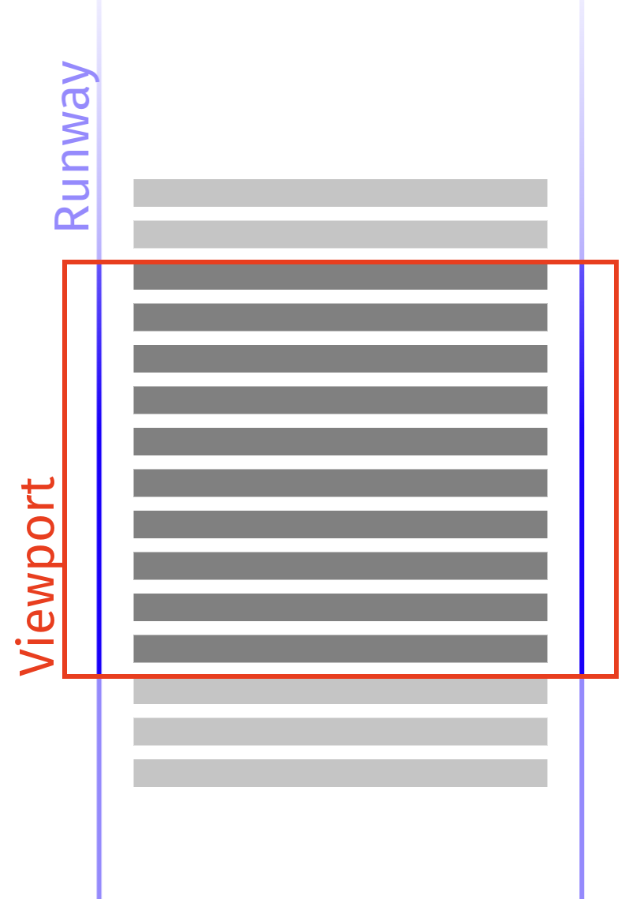

_screenshot taken from https://developer.chrome.com/blog/infinite-scroller/_

#### Runway sizing

A minor, but still notable difference is by how the two implementations size their runway.
The Angular CDK implementation sizes its viewport by adjusting the `height` style of a `spacer` div.
This results in one extremely large layer that puts pressure on the devices memory by storing a
texture on the graphics card that potentially has a height of a couple of hundred thousand pixels.

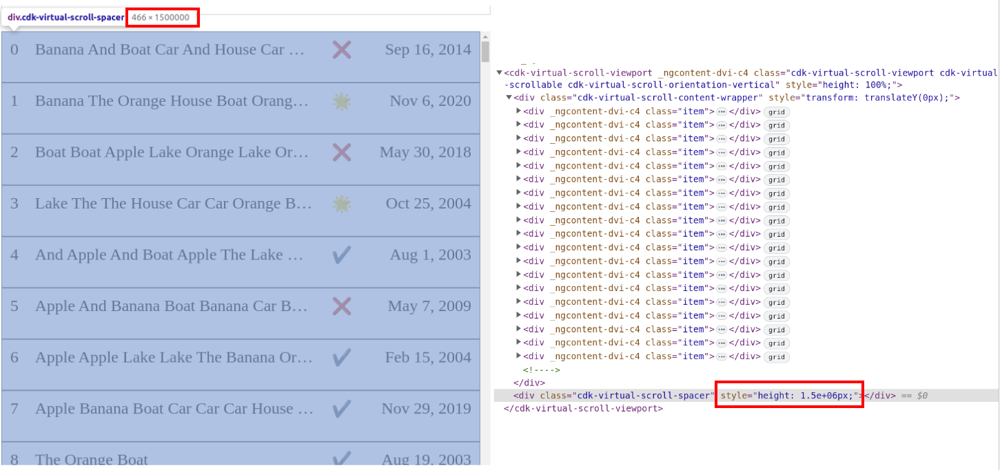

In this example, the layers tool estimates a memory footprint of ~5GB for a runway with 30.000 items.
This number is only an estimate, and we couldn't see such high memory consumption on the actual device, but it
stresses the point.

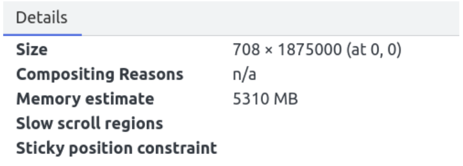

> 💡 You can counter this issue by making sure this layer is completely empty. It will be empty if it has no own paint area (e.g. background-color)
> and all items are forced into their own layers (e.g. using `will-change: transform`)

Another minor, but notable point is that changing an elements `height` property always forces the browser to perform a layout operation.
In certain situations this can lead to more work than actually needed.

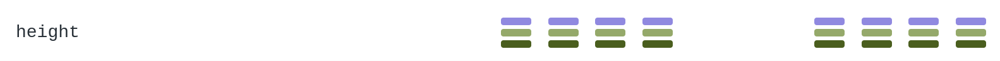

_screenshot taken from https://www.lmame-geek.com/_

The RxAngular implementation uses a 1px by 1px element with a transform to simulate the desired height for the runway. The actual
DOM element won't grow beyond its boundaries.
While this alone is already an improvement, in best case still all items within the runway are enforced on their own layer (e.g. using `will-change: transform`) to make sure
the runway layer is completely empty.

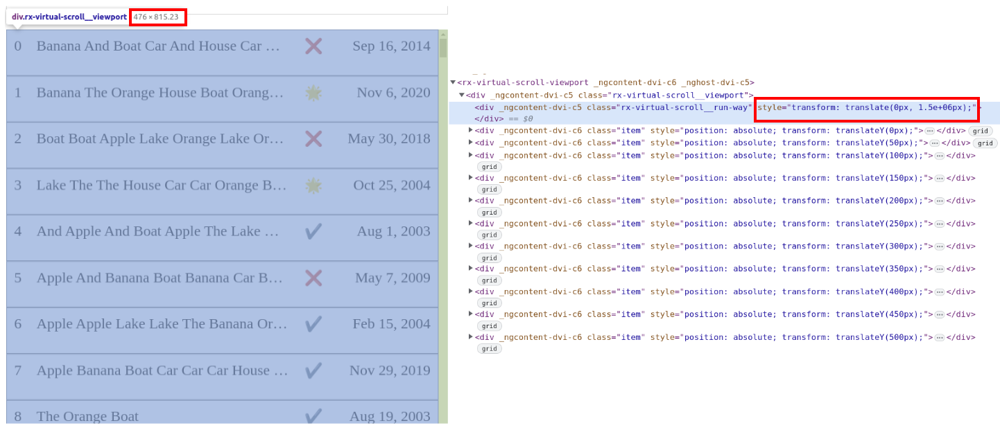

As the runway is sized using the `transform` css property, we also don't run into the situation where resizing the runway would cause any layout
work for the browser.

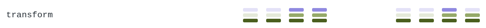

_screenshot taken from https://www.lmame-geek.com/_

#### Maintaining the viewport

The Angular CDK implementation positions its list-items relative, letting the browser do all the layout work. The items are layouted naturally within
a separate container element which is only as large as the items it contains. It is absolutely positioned to the viewport. To keep the visible items
with the viewport in sync, the whole container is moved by the css `transform` on scroll events.

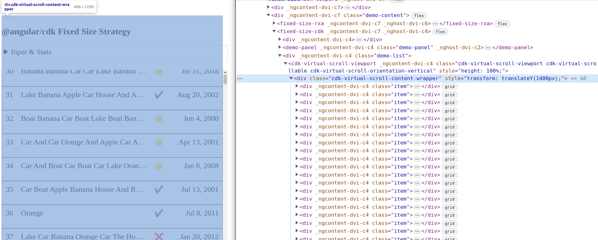

As a user scrolls the viewport, the cdk virtual scroller calculates the range of items to be displayed. The transform value for the container is derived
from the range and the actual view sizes.

```ts
// fixed-size-virtual-scroll.ts
// https://github.com/angular/components/blob/main/src/cdk/scrolling/fixed-size-virtual-scroll.ts#L177

this._viewport.setRenderedContentOffset(this._itemSize * newRange.start);
```

The RxAngular implementation calculates the position for each list item within the runway and absolutely positions each item individually with transforms.

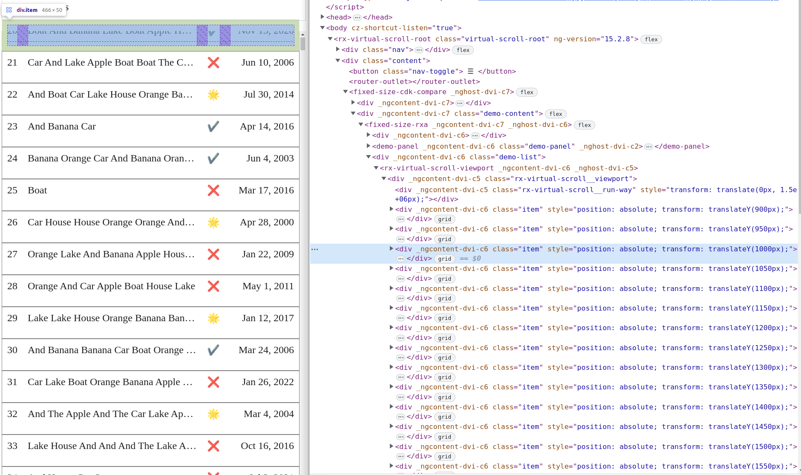

As the layout is done entirely manually, it essentially removes the need for the browser to layout any item within the viewport. This is especially true
for updates, moves and insertions from cache.
"Ideally, items would only get repainted once when they get attached to the DOM and be unfazed by additions or removals of other items in the runway."

(Surma - https://developer.chrome.com/blog/infinite-scroller/#layout)

Furthermore, it allows to implement advanced features such as `scrollToIndex` or emitting a `scrolledIndex` for the [AutosizeVirtualScrollStrategy](#autosizevirtualscrollstrategy).
"Since we are doing layout ourselves, we can cache the positions where each item ends up and we can immediately load the correct element from cache when the user scrolls backwards."

(Surma - https://developer.chrome.com/blog/infinite-scroller/#layout)

### Scheduling

Another major difference is the applied scheduling technique to run "change detection" - applying updates to the DOM.
The Angular CDK package uses the `requestAnimationFrame` to debounce the calculation of the new view range and to run change detection.

All calculated changes will be evaluated synchronously within the very same animationFrameCallback. This can put a lot of javascript & layout work
into a single task. Especially when using a weak device or rendering heavy components as list items, this technique will inevitably result in
long tasks and can result in scroll stuttering. See the [Performance Comparison section](#performance-comparison) for more information about the
actual runtime performance.

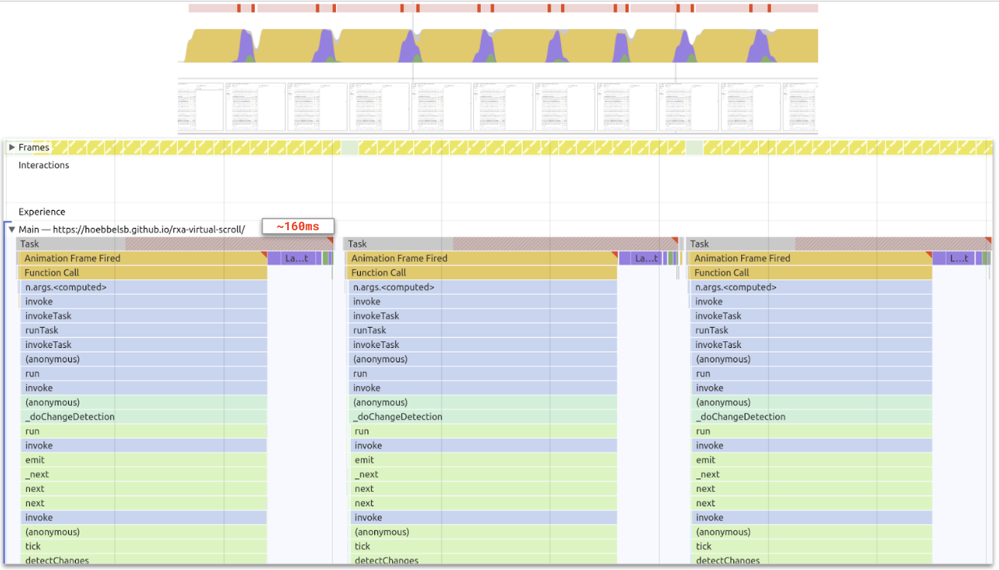

RxAngular's virtual scrolling implementation also uses the `requestAnimationFrame` scheduler, but not for change detection.
It is used for coalescing scroll events and calculation of changes to the view range.

The scheduling being used for running change detection is configurable, by default it uses the [`normal Concurrent Strategy`](../../cdk/render-strategies/strategies/concurrent-strategies.md).
In short, the concurrent strategies batch work into pieces to match a certain frame budget (60fps by default).
Changes to the view range get translated into individual work packages to insert, move, update, delete and position views. The work packages
are then processed individually by keeping the frame budget in mind.

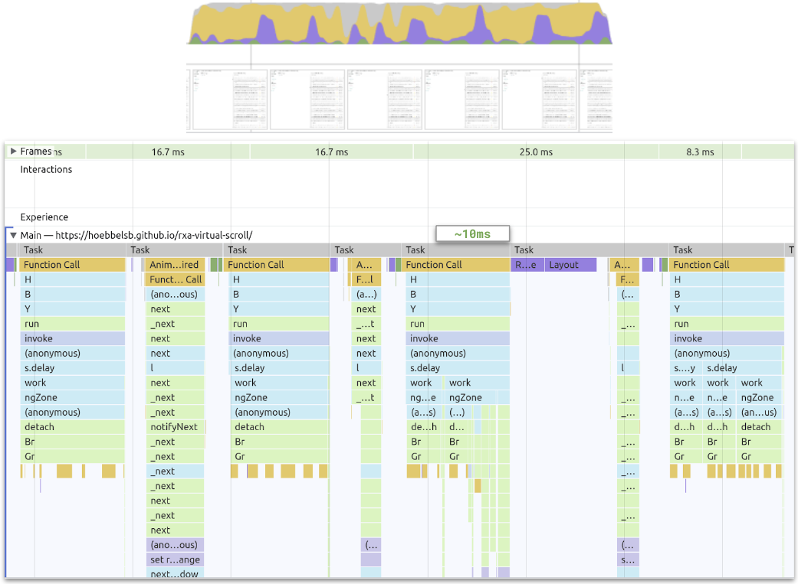

This technique excels in keeping long tasks at a minimum and is especially helpful to render hefty components and/or supporting
weak devices. It helps keeping the scrolling and bootstrap behavior buttery smooth.

See the [Performance Comparison section](#performance-comparison) for more information about the
actual runtime performance.

### Performance Comparison

Performance recordings are taken from the [Demo Application](https://hoebbelsb.github.io/rxa-virtual-scroll/).
The demo application by default displays lists of `30 000` items.

The scenario that was benchmarked here is scrolling over long distances by using the scroll bar. This scenario
puts the most pressure on the virtual scrollers.

### System Setup

|           |                                                            |
| --------- | ---------------------------------------------------------- |
| OS        | `Pop!_OS 22.04 LTS`                                        |
| Browser   | `Chromium Version 112.0.5615.49 (Official Build) (64-bit)` |
| Processor | `Intel® Core™ i7-9750H CPU @ 2.60GHz × 12`               |

### Different Layout techniques

The RxVirtualScrolling approach to layout items is to absolutely position every view inside the viewport. Therefore, it sets the `transform` property for each managed item.
The CDK approach instead transforms the viewport. The following video showcases the difference.

<ReactPlayer playing controls url="https://user-images.githubusercontent.com/4904455/231340169-f65efe6c-863d-49e8-9f4f-183bb38e1b2a.mp4" />

### Fixed Size Strategy

Comparison between [RxAngular FixedSizeVirtualScrollStrategy](#fixedsizevirtualscrollstrategy) and [CdkFixedSizeVirtualScroll](https://material.angular.io/cdk/scrolling/api#CdkFixedSizeVirtualScroll).

[FixedSizeVirtualScrollStrategy comparison Demo](https://hoebbelsb.github.io/rxa-virtual-scroll/#/demos/fixed-size-cdk-compare)

#### Features

| Feature           | `@rx-angular/template/experimental/virtual-scrolling` | `@angular/cdk/scrolling` |
| ----------------- | ----------------------------------------------------- | ------------------------ |
| `scrolledIndex$`  | ✅                                                    | ✅                       |
| `scrollToIndex()` | ✅                                                    | ✅                       |

#### Performance

**No throttling**

Both solutions do fine without throttling. But, the `CdkFixedSizeVirtualScroll` already struggles with the frame rate. We can already spot `partially presented frames`.
Also, the javascript tasks are taking longer compared to the `RxAngular FixedSizeVirtualScrollStrategy`.

| `@rx-angular/template/experimental/virtual-scrolling`                                                          | `@angular/cdk/scrolling`                                                                                       |
| -------------------------------------------------------------------------------------------------------------- | -------------------------------------------------------------------------------------------------------------- |
| 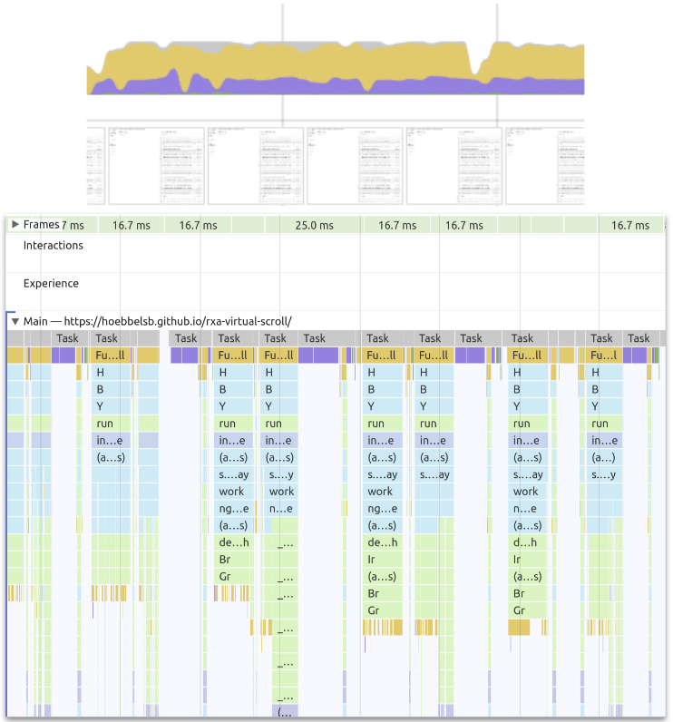 | 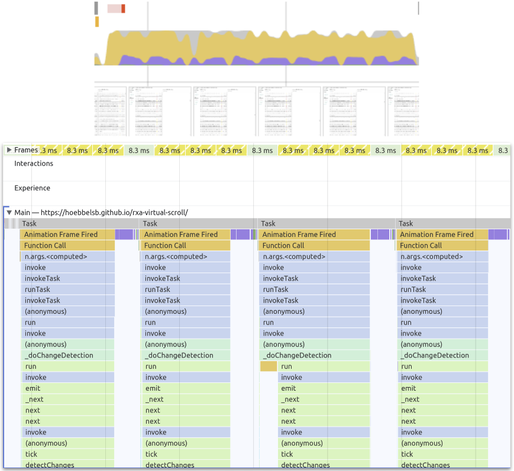 |

**4x CPU throttling**

With throttling enabled, the `CdkFixedSizeVirtualScroll` already struggles a lot with keeping the frame rate above anything reasonable. Javascript tasks take up to ~160ms (long-tasks) and
the amount of `partially presented frames` increases.
The `RxAngular FixedSizeVirtualScrollStrategy` has no issues whatsoever keeping the frame rate above 30fps on 4x times throttling.

| `@rx-angular/template/experimental/virtual-scrolling`                                                      | `@angular/cdk/scrolling`                                                                                   |
| ---------------------------------------------------------------------------------------------------------- | ---------------------------------------------------------------------------------------------------------- |
|  |  |

### Dynamic Size Strategy

Comparison between [RxAngular DynamicSizeVirtualScrollStrategy](#dynamicsizevirtualscrollstrategy) and [CDK AutoSizeVirtualScrollStrategy](https://github.com/angular/components/blob/main/src/cdk-experimental/scrolling/auto-size-virtual-scroll.ts).
As there is no real counterpart to the `DynamicSizeVirtualScrollStrategy`, the comparison was made against the `CDK AutoSizeVirtualScrollStrategy`. This is scroll behavior wise the most comparable
implementation from the cdk package.

[DynamicSizeVirtualScrollStrategy comparison Demo](https://hoebbelsb.github.io/rxa-virtual-scroll/#/demos/dynamic-size-cdk-compare)

#### Features

As an experimental package, the `CDK AutoSizeVirtualScrollStrategy` does not emit the current scrollIndex, nor has it a working `scrollToIndex` method implemented.
The `RxAngular DynamicSizeVirtualScrollStrategy` is able to do both! It emits the current valid scrolledIndex and is able to properly scroll to the
correct position based on an index.

| Feature           | `@rx-angular/template/experimental/virtual-scrolling` | `@angular/cdk/scrolling` |
| ----------------- | ----------------------------------------------------- | ------------------------ |
| `scrolledIndex$`  | ✅                                                    | ❌                       |
| `scrollToIndex()` | ✅                                                    | ❌                       |

#### Performance

**No throttling**

Both solutions do fine without throttling. But, the `CDK AutoSizeVirtualScrollStrategy` struggles with the frame rate. We can already spot lots of `partially presented frames`.
The `RxAngular DynamicSizeVirtualScrollStrategy` implementation easily maintains a stable framerate around 45fps.

| `@rx-angular/template/experimental/virtual-scrolling`                                                                  | `@angular/cdk/scrolling`                                                                                       |
| ---------------------------------------------------------------------------------------------------------------------- | -------------------------------------------------------------------------------------------------------------- |
| 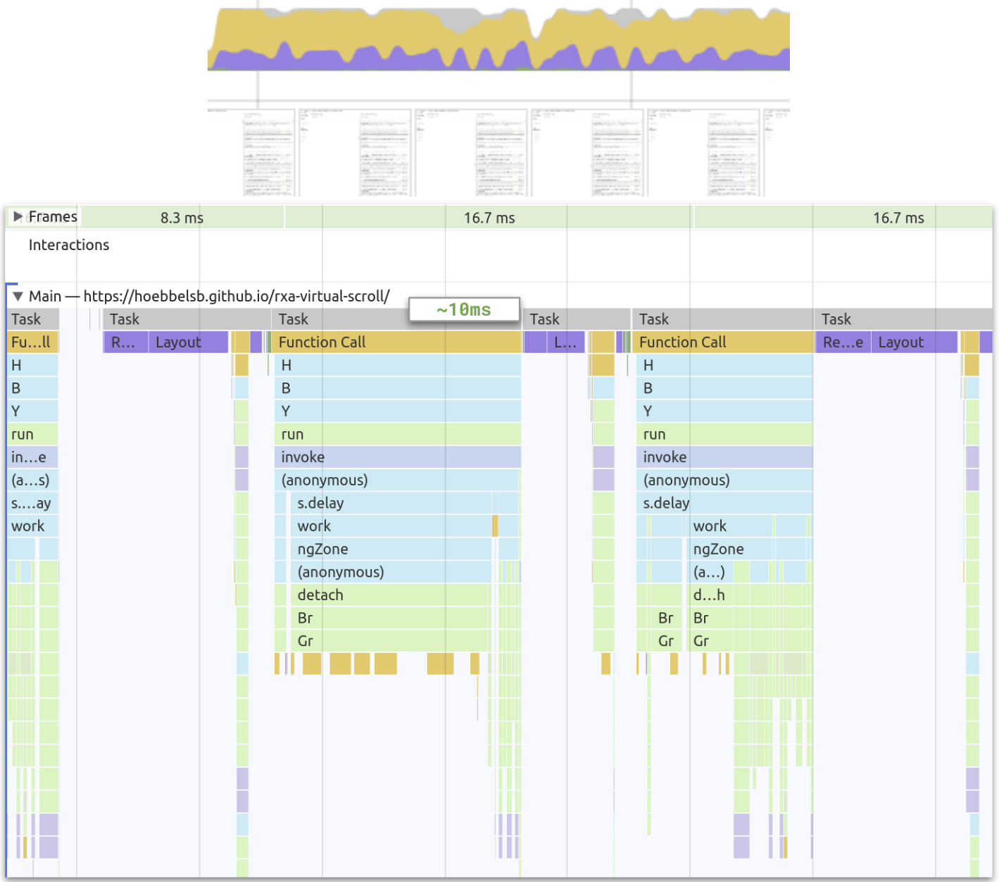 | 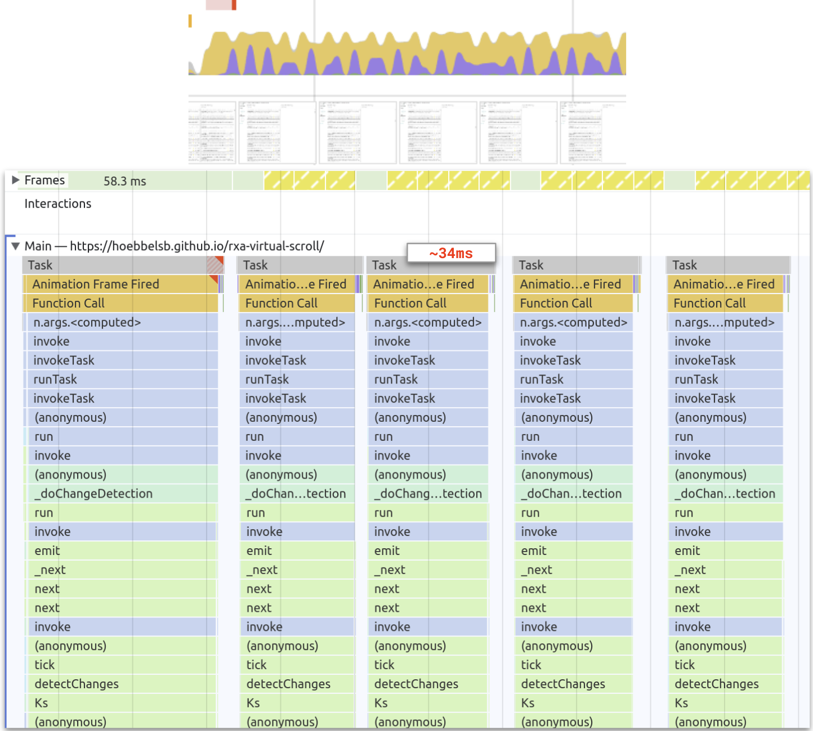 |

**4x CPU throttling**

With throttling enabled, the `CDK AutoSizeVirtualScrollStrategy` struggles a lot with keeping the frame rate above anything reasonable. Javascript tasks take up more than ~160ms (long-tasks) and
the amount of `partially presented frames` increases.
The `RxAngular DynamicSizeVirtualScrollStrategy` has no issues whatsoever keeping the frame rate above 30fps on 4x times throttling. The javascript execution time is still very low, the style
recalculations and layouting phases are increasing, though. This will also depend very much on the actual use case.

| `@rx-angular/template/experimental/virtual-scrolling`                                                              | `@angular/cdk/scrolling`                                                                                   |
| ------------------------------------------------------------------------------------------------------------------ | ---------------------------------------------------------------------------------------------------------- |
| 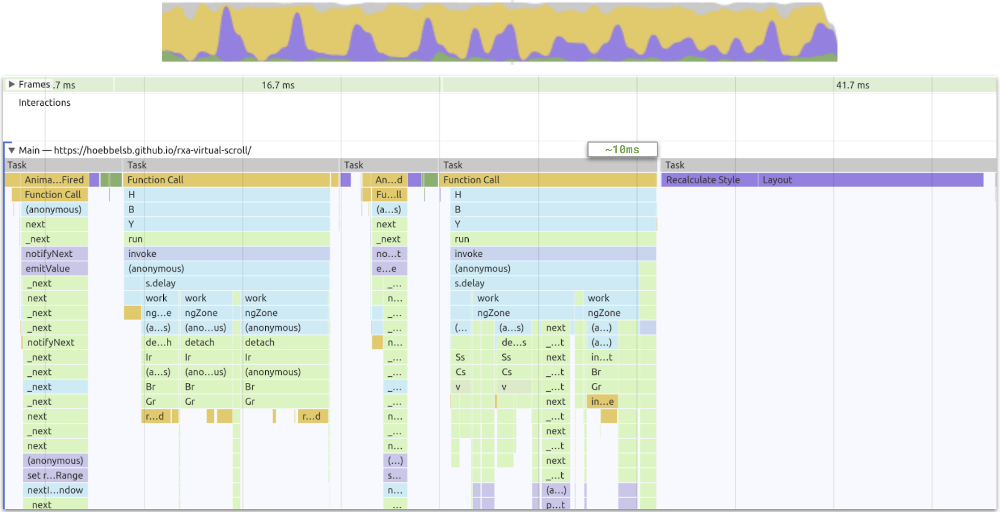 | 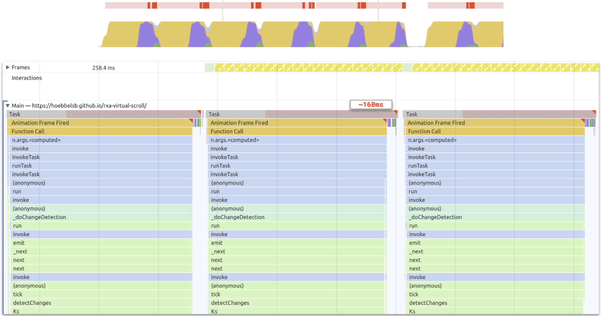 |

### Autosize Strategy

Comparison between [RxAngular AutoSizeVirtualScrollStrategy](#autosizevirtualscrollstrategy) and [CDK AutoSizeVirtualScrollStrategy](https://github.com/angular/components/blob/main/src/cdk-experimental/scrolling/auto-size-virtual-scroll.ts).

[AutoSizeVirtualScrollStrategy comparison Demo](https://hoebbelsb.github.io/rxa-virtual-scroll/#/demos/autosize-cdk-compare)

#### Features

As an experimental package, the `CDK AutoSizeVirtualScrollStrategy` does not emit the current scrollIndex, nor has it a working `scrollToIndex` method implemented.
The `RxAngular AutoSizeVirtualScrollStrategy` is able to do both! It emits the current valid scrolledIndex and is able to properly scroll to the
correct position based on an index.

| Feature           | `@rx-angular/template/experimental/virtual-scrolling` | `@angular/cdk/scrolling` |
| ----------------- | ----------------------------------------------------- | ------------------------ |
| `scrolledIndex$`  | ✅                                                    | ❌                       |
| `scrollToIndex()` | ✅                                                    | ❌                       |

#### Performance

**No throttling**

For the `CDK AutoSizeVirtualScrollStrategy`, the same is true as for the comparison vs. the `DynamicSizeVirtualScrollStrategy`.
The `RxAngular AutoSizeVirtualScrollStrategy` implementation easily maintains a stable framerate of 60fps. You see the reason why it can maintain this framerate in the
comparison flameshots. The AutoSizeVirtualScrollStrategy puts all the layouting work into the RxAngular scheduler queue which will keep the framebudget for us.
For each inserted view, the `AutoSizeVirtualScrollStrategy` will cause a forced reflow as it immediately reads its dimensions. It sounds like a disadvantage, but in reality
the scrolling performance benefits from this approach. Anyway, that's why we such heavy `rendering` peaks (purple color).
Nodes that were visited once are not queried again, scrolling the same path twice will differ in runtime performance. All consequent attempts should be as fast as the fixed or dynamic
size implementations.

| `@rx-angular/template/experimental/virtual-scrolling`                                                          | `@angular/cdk/scrolling`                                                                                       |
| -------------------------------------------------------------------------------------------------------------- | -------------------------------------------------------------------------------------------------------------- |
| 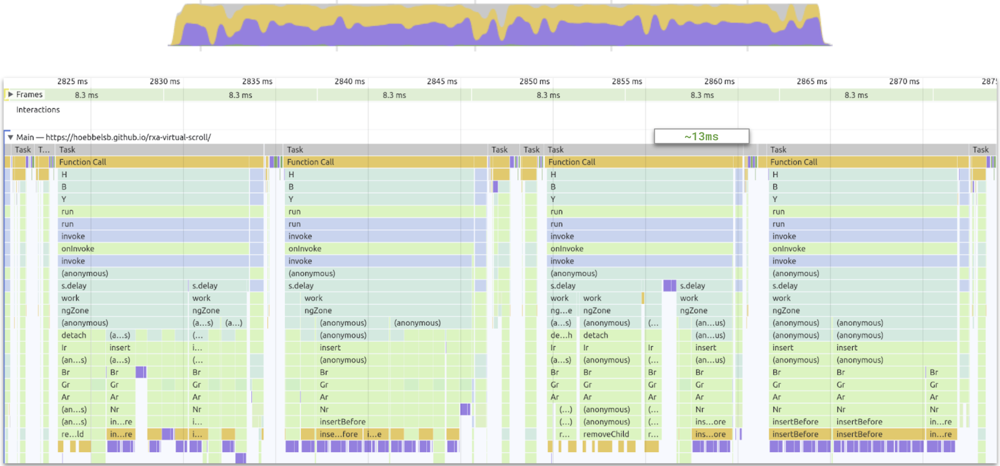 |  |

**4x CPU throttling**

For the `CDK AutoSizeVirtualScrollStrategy`, the same is true as for the comparison vs. the `DynamicSizeVirtualScrollStrategy`.

Even with 4x CPU throttling enabled, the `RxAngular AutoSizeVirtualScrollStrategy` keeps a reasonable frame rate and only sometimes produces partially presented frames.
Thanks to the concurrent strategies, users will never encounter long tasks while scrolling.

| `@rx-angular/template/experimental/virtual-scrolling`                                                      | `@angular/cdk/scrolling`                                                                                   |
| ---------------------------------------------------------------------------------------------------------- | ---------------------------------------------------------------------------------------------------------- |
| 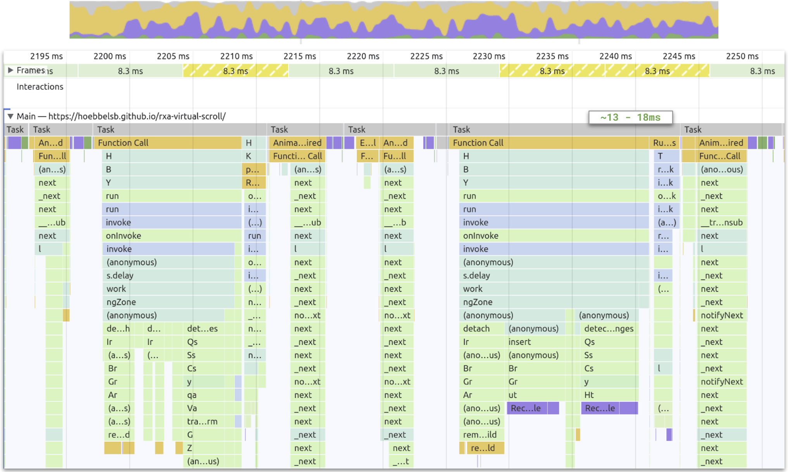 |  |

## Further Improvements

The following section describes features that are currently not implemented, but planned.

### Support other orientations

Right now, the `@rx-angular/template/experimental/virtual-scrolling` package only supports vertical scrolling. In the future, it should also
be able to support horizontal scrolling.

This is currently supported by [`@angular/cdk/scrolling`](https://material.angular.io/cdk/scrolling/overview#viewport-orientation).

Issue link: https://github.com/rx-angular/rx-angular/issues/1554

### Support grid virtual scrolling

Displaying items in a list or a grid is a common feature when viewing huge result sets, this is particularly useful for supporting responsive screen sizes, and taking advantage of available real-estate.

Issue link: https://github.com/rx-angular/rx-angular/issues/1550

### Support viewport and scrolling element separation

Right now, the `@rx-angular/template/experimental/virtual-scrolling` package only supports the `RxVirtualScrollViewportComponent` to be the
scrolling element. However, there are cases where you want to define a separate scrolling element, e.g. to support window scrolling.

This is currently supported by [`@angular/cdk/scrolling`](https://material.angular.io/cdk/scrolling/overview#separate-viewport-and-scrolling-element) and is planned for RxAngular as well.

Issue link: https://github.com/rx-angular/rx-angular/issues/1555

### Tombstones

Tombstones, skeletons or placeholder templates are a nice way to improve the scrolling performance, especially when the actual views being rendered
are heavy and take a long time to create. Especially for the autosized strategy this can increase the visual stability and runtime performance a lot.

The concept is described in the article [Complexities of an infinite scroller](https://developer.chrome.com/blog/infinite-scroller/#tombstones)
and visible in the corresponding [demo](http://googlechromelabs.github.io/ui-element-samples/infinite-scroller/).

Issue link: https://github.com/rx-angular/rx-angular/issues/1556

## Resources

**Demos:**
A showcase for [RxVirtualFor](https://hoebbelsb.github.io/rxa-virtual-scroll/)
A showcase for [RxVirtualFor vs. CdkVirtualFor](https://hoebbelsb.github.io/rxa-virtual-scroll/#/demos/fixed-size-cdk-compare)

**Blog Posts**

- [complexities of infinite scrollers](https://developer.chrome.com/blog/infinite-scroller/)
