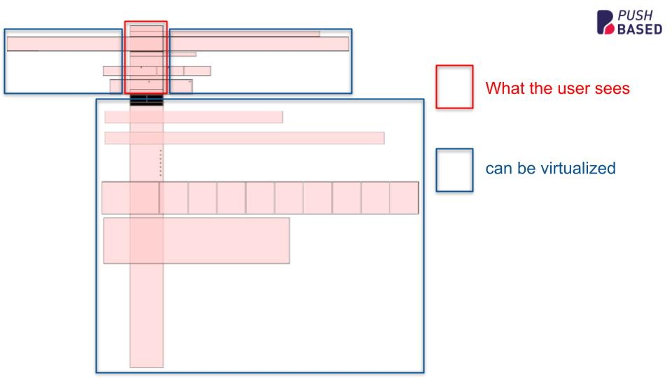

import Tabs from '@theme/Tabs';
import TabItem from '@theme/TabItem';

:::info Developer preview

This feature is under developer preview. It won't follow semver.

:::

## Motivation

A large number of DOM elements can significantly impact performance, leading to slow initial load times and sluggish interactions.

Especially mobile users have a very limited viewport available. Most of the pages contents are hidden below
the fold. So why render them at all?

When dealing with large lists or data sets there is a technique, known as virtual scrolling or windowing.
It drastically improves the performance of your Angular applications.

However, if you are not working with plain lists, or highly dynamic components, the concept of virtual scrolling isn't applicable.
This is true for:

- masonry layouts
- dynamic grids
- landing pages with widgets

This is where the RxVirtualView directive comes in. It provides a simple way to only display the elements that are currently visible to
the user.



## Usage

RxVirtualView is designed to work in combination with related directives:

- `rxVirtualView`: Defines the DOM node being observed for visibility.
- `rxVirtualViewTemplate`: Defines the template shown when the observed node is visible.
- `rxVirtualViewPlaceholder`: Defines the placeholder shown when the observed node isn't visible.
- `rxVirtualViewObserver`: Defines the node being used for the `IntersectionObserver`. Provides cache & other services.

### Basic Usage

```html
<!-- use the root node (html) for the IntersectionObserver -->
<div rxVirtualViewObserver [root]="null">
  <div class="item" rxVirtualView>
    <!-- this will be the template when .item is visible to the user -->
    <div *rxVirtualViewTemplate>Virtual View 1</div>
    <!-- this will be the template when .item isn't visible to the user -->
    <div *rxVirtualViewPlaceholder>
      Placeholder
      <div></div>
    </div>
  </div>
</div>
```

This setup will:

1. Use rxVirtualViewObserver to monitor the visibility of the rxVirtualView element.
2. Render the content of rxVirtualViewTemplate when the element is visible.
3. Show the rxVirtualViewPlaceholder when the element is not visible.

### Advanced Usage

You can further customize the behavior of RxVirtualView using these optional inputs:

- `cacheEnabled`: Whether to cache the templates and placeholders.
- `startWithPlaceholderAsap`: Whether to render the placeholder immediately.
- `keepLastKnownSize`: Whether to keep the last known size of the element.
- `useContentVisibility`: Whether to use the content-visibility CSS property.
- `useContainment`: Whether to use the contain CSS property.
- `placeholderStrategy`: The rendering strategy for the placeholder.
- `templateStrategy`: The rendering strategy for the template.

## Examples

### Optimizing Lists

This example demonstrates how to use RxVirtualView to optimize a long list by only rendering the visible list items.
We are only rendering the `item` component when it's visible to the user. Otherwise, it gets replaced by an empty div.

:::tip Define placeholder dimensions

The placeholder is what makes or breaks your experience with `RxVirtualView`. In best case it's just
an empty container which has just the same dimensions as its template it should replace.

This will make sure you don't run into stuttery scrolling behavior and layout shifts.

:::

```html
<div rxVirtualViewObserver class="container">
  @for (item of items; track item.id) {
  <div class="item" rxVirtualView>
    <item *rxVirtualViewTemplate [item]="item" />
    <div *rxVirtualViewPlaceholder style="height: 50px;"></div>
  </div>
  }
</div>
```
