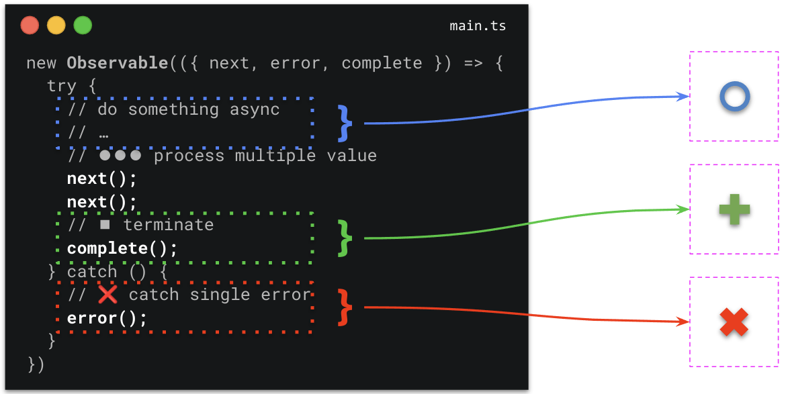

## Description


In order to provide high quality user experiences, developers have to take care about giving users proper feedback
based on their actions with an application. Most of the time external resources (http, databases, websockets, ...) are used
to read/write data. Operations involving third party resources are asynchronous and don't give immediate feedback.

In order to provide feedback to the user, we implement features such as loading spinners, refresh indicators, error dialogs, success messages.
The reactive context is the context we can derive from asynchronous/reactive data structures such as `Promise` or `Observable`.

The following example showcases how we identify the reactive context from an `Observable`:



Besides the actual value channel (`next`), we can derive the following three contexts:

- `suspense` => the stream has not emitted data yet
- `error` => the stream encountered an error
- `complete` => the stream completed, won't emit another value

Based on the contexts we can decide what to present our user.

## Usage in the template

The `@rx-angular/template` directives are capable of
deriving the reactive context for you.
There are two ways of handling them, with `reactive context templates` or `reactive context variables`.

The following table shows how the reactive context is treated **on initial rendering**. Note how there are
slight differences between context templates and context variables.

| value                                                           | Context Templates | Context Variables |
| --------------------------------------------------------------- | ----------------- | ----------------- |
| `undefined`                                                     | suspense          | _no render_       |
| primitive values (`number`, `string`, `boolean`, ..)            | next              | next              |
| `Observable` emitting `undefined`                               | suspense          | suspense          |
| `Observable` or `Promise` not yet emitted a value (e.g `NEVER`) | suspense          | _no render_       |
| `Observable` emitting any value !== `undefined`                 | next              | next              |
| `Observable` completing (e.g `EMPTY`)                           | complete          | complete          |
| `Promise` emitting any value                                    | suspense          | suspense          |
| `Observable` throwing an error                                  | error             | error             |

### Reactive Context Templates

The following example showcases how to use the reactive context by assigning
dedicated templates to every possible context value.

The `rxLet` directive will take care of deriving the reactive context from the source
observable and displaying the corresponding template accordingly.

```html
<ng-container
  *rxLet="
    value$;
    let value;
    error: error;
    complete: complete;
    suspense: suspense;
  "
>
  {{ value }}
</ng-container>

<ng-template #suspense>SUSPENSE</ng-template>
<ng-template #error>ERROR</ng-template>
<ng-template #complete>COMPLETE</ng-template>
```

> The initial suspense template will be displayed when the bound `Observable` has not yet emitted
> a value or emits `undefined` as a value

The following values will result in the `suspense` template being displayed:

```ts
// all of the following values will result in the suspense template being displayed

value$ = undefined;

value$ = new Subject();

value$ = new BehaviorSubject(undefined);
```

### Reactive Context Variables

The `RxViewContext` interface defines all possible states we can use in our template
to enrich the user experience.

```ts
export interface RxViewContext<T> {
  // to enable `let` syntax we have to use $implicit (var; let v = var)
  $implicit: T;
  // set context var complete to true (var$; let e = error)
  error: boolean | Error;
  // set context var complete to true (var$; let c = complete)
  complete: boolean;
  // set context var suspense to true (var$; let s = suspense)
  suspense: boolean;
}
```

The following example showcases how to use the reactive context by using
the context variables.

The `rxLet` directive will take care of deriving the reactive context from the source
observable and set the corresponding context accordingly.

```html
<ng-container
  *rxLet="
    value$;
    let value;
    let error = error;
    let complete = complete;
    let suspense = suspense;
  "
>
  {{ value }}

  <loader *ngIf="suspense;"></loader>
  <error *ngIf="error;"></error>
  <complete *ngIf="complete; then: complete"></complete>
</ng-container>
```

> The initial suspense context will only be displayed for a given `Observable` that
> emits an `undefined` value. If no value is provided or emitted, no template will be rendered.

The following values will result in the `suspense` context being rendered:

```ts
// all of the following values will result in the suspense context being set to true

value$ = new BehaviorSubject(undefined);

values$ = service.asyncOperation().pipe(startWith(undefined));
```
