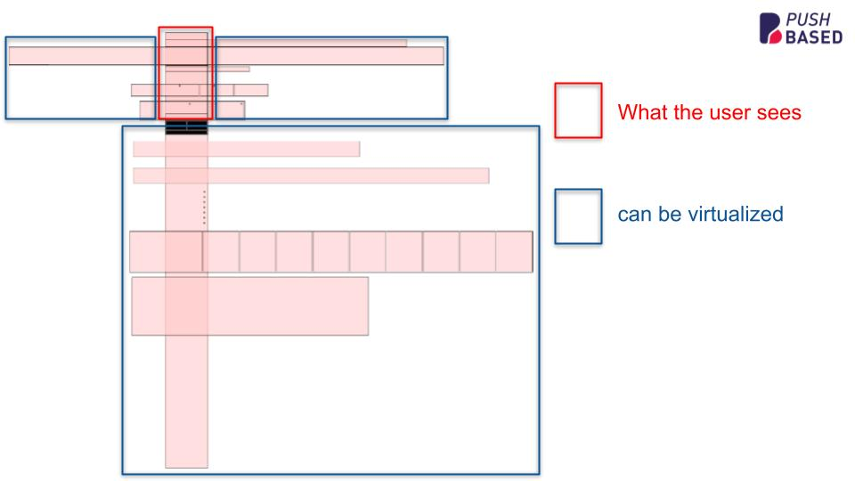

import Tabs from '@theme/Tabs';
import TabItem from '@theme/TabItem';

:::info Developer preview

This feature is under developer preview. It won't follow semver.

:::

## Motivation

A large number of DOM elements can significantly impact performance, leading to slow initial load times and sluggish interactions.

Especially mobile users have a very limited viewport available. Most of the pages contents are hidden below
the fold. So why render them at all?

When dealing with large lists or data sets there is a technique, known as virtual scrolling or windowing.
It drastically improves the performance of your Angular applications.

However, if you are not working with plain lists, or highly dynamic components, the concept of virtual scrolling isn't applicable.
This is true for:

- masonry layouts
- dynamic grids
- landing pages with widgets

This is where the RxVirtualView directive comes in. It provides a simple way to only display the elements that are currently visible to
the user.



## Basic Usage

RxVirtualView is designed to work in combination with related directives:

- `rxVirtualViewObserver`: Defines the node being used for the `IntersectionObserver`. Provides cache & other services.
- `rxVirtualView`: Defines the DOM node being observed for visibility.
- `rxVirtualViewContent`: Defines the content shown when the observed node is visible.
- `rxVirtualViewPlaceholder`: (Optional) Defines the placeholder shown when the observed node isn't visible.

### Show a widget when it's visible, otherwise show a placeholder

```typescript
import { RxVirtualView, RxVirtualViewContent, RxVirtualViewObserver, RxVirtualViewPlaceholder } from '@rx-angular/template/virtual-view';
// Other imports...

@Component({
  selector: 'my-list',
  imports: [RxVirtualView, RxVirtualViewContent, RxVirtualViewObserver, RxVirtualViewPlaceholder],
  templateUrl: './my-list.component.html',
  styleUrls: ['./my-list.component.scss'],
  changeDetection: ChangeDetectionStrategy.OnPush,
})
export class MyListComponent {
  // Component code
}
```

```html
<!-- use the root node (html) for the IntersectionObserver -->
<div rxVirtualViewObserver [root]="null">
  <!-- observe the visibility of `.widget` -->
  <div class="widget" rxVirtualView>
    <!-- this will be the template when .widget is visible to the user -->
    <widget *rxVirtualViewContent />
    <!-- this will be the template when .widget isn't visible to the user -->
    <div *rxVirtualViewPlaceholder class="widget-placeholder">
      Placeholder
      <div></div>
    </div>
  </div>
</div>
```

This setup will:

1. Use rxVirtualViewObserver to monitor the visibility of the rxVirtualView element.
2. Render the content of rxVirtualViewContent when the element is visible.
3. Show the rxVirtualViewPlaceholder when the element is not visible.

### Define placeholder dimensions

The placeholder is what makes or breaks your experience with `RxVirtualView`. In best case it's just
an empty container that has just the same dimensions as its content it should replace.

This will make sure you don't run into stuttery scrolling behavior and layout shifts.

You can use the `--rx-vw-h` and `--rx-vw-w` CSS variables to define the placeholder dimensions after the virtual view is rendered at least once.

```html
<div *rxVirtualViewPlaceholder style="min-height: var(--rx-vw-h, 100px); min-width: var(--rx-vw-w, 50px);"></div>
```

If the virtual view is not rendered at least once, the 100px and 50px values will be used as fallback the first time, and after that, the values will be updated to the actual dimensions of the virtual view.

### Optimize lists with @for

This example demonstrates how to use RxVirtualView to optimize lists by only rendering the visible list items.
We are only rendering the `item` component when it's visible to the user. Otherwise, it gets replaced by an empty div.

```typescript
import { RxVirtualView, RxVirtualViewContent, RxVirtualViewObserver, RxVirtualViewPlaceholder } from '@rx-angular/template/virtual-view';
// Other imports...

@Component({
  selector: 'my-list',
  imports: [RxVirtualView, RxVirtualViewContent, RxVirtualViewObserver, RxVirtualViewPlaceholder],
  templateUrl: './my-list.component.html',
  styleUrls: ['./my-list.component.scss'],
  changeDetection: ChangeDetectionStrategy.OnPush,
})
export class MyListComponent {
  // Component code
}
```

```html
<div rxVirtualViewObserver class="container">
  @for (item of items; track item.id) {
  <div class="item" rxVirtualView>
    <item *rxVirtualViewContent [item]="item" />
    <div *rxVirtualViewPlaceholder style="height: 50px;"></div>
  </div>
  }
</div>
```

### React to visibility changes

You can use the `visibilityChanged` output to react to visibility changes of the virtual view.
Or you can use the `visibility` property to access the current visibility state in your template using `exportAs`.

```html
<div rxVirtualViewObserver>
  <div rxVirtualView #virtualView="rxVirtualView" (visibilityChanged)="onVisibilityChanged($event)">
    <widget *rxVirtualViewContent />
    <div *rxVirtualViewPlaceholder>Loading...</div>
  </div>

  @if (virtualView.visibility.placeholder) {
  <p>Content is currently being virtualized...</p>
  }
</div>
```

```typescript
onVisibilityChanged(event: { content: boolean; placeholder: boolean }) {
  console.log('Content visible:', event.content);
  console.log('Placeholder visible:', event.placeholder);
}
```

## Using RxVirtualView with hydration (SSR)

When you use Angular with server-side rendering (SSR) or client hydration, the server sends HTML with full content. If the virtual view were active immediately on the client, it could replace that content with placeholders as soon as the IntersectionObserver runs, causing a flash and destroying components that were just hydrated.

To avoid that, you can **disable** the virtual view until hydration is complete, then optionally **enable** it so that virtual behavior (placeholders when out of view) applies only after the app is interactive.

### 1. Disable virtual behavior until hydrated (`enabled`)

Use the global config option **`enabled`** (a `boolean` or a **`Signal<boolean>`**). When `enabled` is `false`:

- The directive renders **content** synchronously (no IntersectionObserver).
- No placeholders are shown; everything behaves like normal, non-virtual content.

That way, on the server and during hydration the user sees the full content. Once you set `enabled` to `true` (e.g. when hydration is done), the directive can start observing visibility.

**Example: enable virtual view only after hydration**

Use [HydrationTracker](https://rx-angular.io/docs/cdk/hydration-tracker) from `@rx-angular/cdk/ssr` and pass its signal as `enabled`:

```typescript
// app.config.ts
import { ApplicationConfig, inject } from '@angular/core';
import { provideVirtualViewConfig } from '@rx-angular/template/virtual-view';

export const appConfig: ApplicationConfig = {
  providers: [
    provideVirtualViewConfig(() => {
      const hydrationTracker = inject(HydrationTracker);
      return {
        enabled: hydrationTracker.isFullyHydrated,
      };
    }),
  ],
};
```

Until `isFullyHydrated` is `true`, the virtual view stays disabled and shows content everywhere. After hydration, `enabled` becomes `true` and the directive can start virtualizing.

### 2. Control behavior after hydration (`enableAfterHydration`)

When the directive **starts disabled** (e.g. `enabled` is `false` during SSR/hydration) and later becomes **enabled**, one question is: should it start observing visibility and swap visible content for placeholders when elements scroll out of view?

That’s what **`enableAfterHydration`** controls (provider-level config only).

| Value                | Behavior                                                                                                                                                                                                             |
| -------------------- | -------------------------------------------------------------------------------------------------------------------------------------------------------------------------------------------------------------------- |
| **`true`** (default) | After `enabled` turns `true`, the directive registers the IntersectionObserver. Elements that scroll out of view will show placeholders; virtual behavior is fully active.                                           |
| **`false`**          | After `enabled` turns `true`, the directive **does not** register the observer. Hydrated content stays as-is and is never replaced by placeholders. Use this to avoid destroying components that were just hydrated. |

**When to use `enableAfterHydration: false`**

- You want the **first paint** to match the server (no placeholders) and you’re okay with **not** virtualizing that page after hydration (e.g. long, mostly-static landing pages).
- You want to avoid any risk of destroying freshly hydrated components or causing layout shifts right after hydration.

**When to keep `enableAfterHydration: true` (default)**

- You want **full virtual behavior** after hydration: once the app is interactive, elements that leave the viewport should show placeholders again to save DOM and work.

**Example: keep hydrated content, no virtualizing after**

```typescript
provideVirtualViewConfig(() => {
  const hydrationTracker = inject(HydrationTracker);
  return {
    enabled: hydrationTracker.isFullyHydrated,
    enableAfterHydration: false, // hydrated nodes stay content; no placeholders later
  };
});
```

**Example: full virtual behavior after hydration (default)**

```typescript
provideVirtualViewConfig(() => {
  const hydrationTracker = inject(HydrationTracker);
  return {
    enabled: hydrationTracker.isFullyHydrated,
    enableAfterHydration: true, // after hydration, virtualize as usual (default)
  };
});
```

### Summary

| Config                                                             | Purpose                                                                                                                                         |
| ------------------------------------------------------------------ | ----------------------------------------------------------------------------------------------------------------------------------------------- |
| `enabled: false` or `enabled: signalThatBecomesTrueAfterHydration` | Turn off virtual behavior on the server and during hydration; turn it on only when appropriate (e.g. after `HydrationTracker.isFullyHydrated`). |
| `enableAfterHydration: true`                                       | Once `enabled` becomes true, start observing and show placeholders when elements leave the viewport.                                            |
| `enableAfterHydration: false`                                      | Once `enabled` becomes true, do **not** start observing; keep hydrated content and never replace it with placeholders.                          |

## Configuration & Inputs

### RxVirtualViewObserver Inputs

| Input        | Type                               | description                                                                                                                                                                                              |
| ------------ | ---------------------------------- | -------------------------------------------------------------------------------------------------------------------------------------------------------------------------------------------------------- |
| `root`       | ` ElementRef \ HTMLElement \ null` | The element where the IntersectionObserver is applied to. `null` referes to the browser viewport. See more [here](https://developer.mozilla.org/en-US/docs/Web/API/Intersection_Observer_API#root)       |
| `rootMargin` | `string`                           | Margin around the root. See more [here](https://developer.mozilla.org/en-US/docs/Web/API/Intersection_Observer_API#rootMargin)                                                                           |
| `threshold`  | `number \ number[]`                | Indicate at what percentage of the target's visibility the observer's callback should be executed. See more [here](https://developer.mozilla.org/en-US/docs/Web/API/Intersection_Observer_API#threshold) |

### RxVirtualView Inputs

| Input                      | Type      | description                                                                                                                                                                                                                                                                                                                                                |
| -------------------------- | --------- | ---------------------------------------------------------------------------------------------------------------------------------------------------------------------------------------------------------------------------------------------------------------------------------------------------------------------------------------------------------- |
| `cacheEnabled`             | `boolean` | Useful when we want to cache the contents and placeholders to optimize view rendering.                                                                                                                                                                                                                                                                     |
| `startWithPlaceholderAsap` | `boolean` | Whether to start with the placeholder asap or not. If `true`, the placeholder will be rendered immediately, without waiting for the content to be visible. This is useful when you want to render the placeholder immediately, but you don't want to wait for the content to be visible. This is to counter concurrent rendering, and to avoid flickering. |
| `keepLastKnownSize`        | `boolean` | This will keep the last known size of the host element while the content is visible. It sets 'minHeight' to the host node                                                                                                                                                                                                                                  |
| `useContentVisibility`     | `boolean` | It will add the `content-visibility` CSS class to the host element, together with `contain-intrinsic-width` and `contain-intrinsic-height` CSS properties.                                                                                                                                                                                                 |
| `useContainment`           | `boolean` | It will add `contain` css property with: <br/> - `size layout paint`: if `useContentVisibility` is `true` && placeholder is visible <br/> - `content`: if `useContentVisibility` is `false` or content is visible                                                                                                                                          |
| `placeholderStrategy`      | `boolean` | The strategy to use for rendering the placeholder. <br/> Defaults to: `low` <br/> [Read more about strategies](../cdk/render-strategies/strategies/concurrent-strategies)                                                                                                                                                                                  |
| `contentStrategy`          | `boolean` | The strategy to use for rendering the content. <br/> Defaults to: `normal` <br/> [Read more about strategies](../cdk/render-strategies/strategies/concurrent-strategies)                                                                                                                                                                                   |

### RxVirtualView Outputs

| Output              | Type                                         | description                                                                                                                                                             |
| ------------------- | -------------------------------------------- | ----------------------------------------------------------------------------------------------------------------------------------------------------------------------- |
| `visibilityChanged` | `{ content: boolean; placeholder: boolean }` | Emits whenever the virtual view transitions between showing content and showing placeholder. The emitted value contains the current visibility state of both templates. |

### RxVirtualViewConfig

Defines an interface representing all configuration that can be adjusted on provider level.

```typescript
export interface RxVirtualViewConfig {
  /** Whether the virtual view is active. Can be a boolean or a signal (e.g. from HydrationTracker). When false, content is rendered synchronously (useful for SSR/hydration). */
  enabled: boolean | Signal<boolean>;
  keepLastKnownSize: boolean;
  useContentVisibility: boolean;
  useContainment: boolean;
  placeholderStrategy: RxStrategyNames<string>;
  contentStrategy: RxStrategyNames<string>;
  cacheEnabled: boolean;
  startWithPlaceholderAsap: boolean;
  /** When the directive starts disabled and later becomes enabled: if true (default), register the visibility observer and virtualize; if false, keep showing content and never swap to placeholders. See [Using RxVirtualView with hydration](#using-rxvirtualview-with-hydration-ssr). */
  enableAfterHydration: boolean;
  cache: {
    /**
     * The maximum number of contents that can be stored in the cache.
     * Defaults to 20.
     */
    contentCacheSize: number;

    /**
     * The maximum number of placeholders that can be stored in the cache.
     * Defaults to 20.
     */
    placeholderCacheSize: number;
  };
}
```

### Customize the config

When you want to customize the default configuration on any provider level (e.g. component, appConfig, route, ...), you can use the `provideVirtualViewConfig` function.

```typescript
import { ApplicationConfig } from '@angular/core';
import { provideVirtualViewConfig } from '@rx-angular/template/virtual-view';

const appConfig: ApplicationConfig = {
  providers: [
    provideVirtualViewConfig({
      /* your custom configuration */
    }),
  ],
};
```

### Default configuration

This is the default configuration which will be used when no other config was provided.

```typescript
{
  enabled: true,
  keepLastKnownSize: false,
  useContentVisibility: false,
  useContainment: true,
  placeholderStrategy: 'low',
  contentStrategy: 'normal',
  startWithPlaceholderAsap: false,
  enableAfterHydration: true,
  cacheEnabled: true,
  cache: {
    contentCacheSize: 20,
    placeholderCacheSize: 20,
  },
}
```

**Hydration:** For SSR/hydration, set `enabled` to a signal that becomes `true` after hydration (e.g. `HydrationTracker.isFullyHydrated`) and optionally set `enableAfterHydration` to control behavior once virtual view is enabled. See [Using RxVirtualView with hydration (SSR)](#using-rxvirtualview-with-hydration-ssr).
