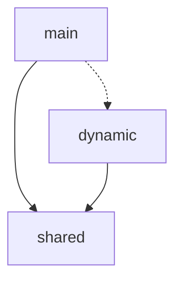
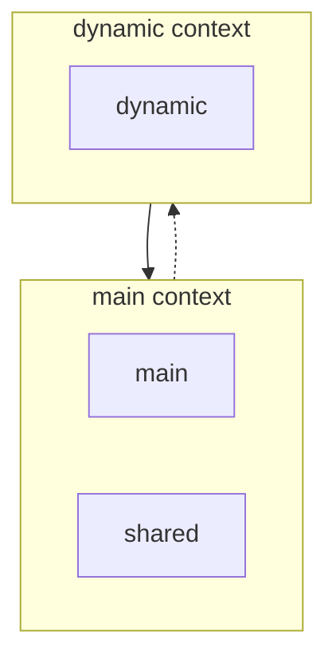
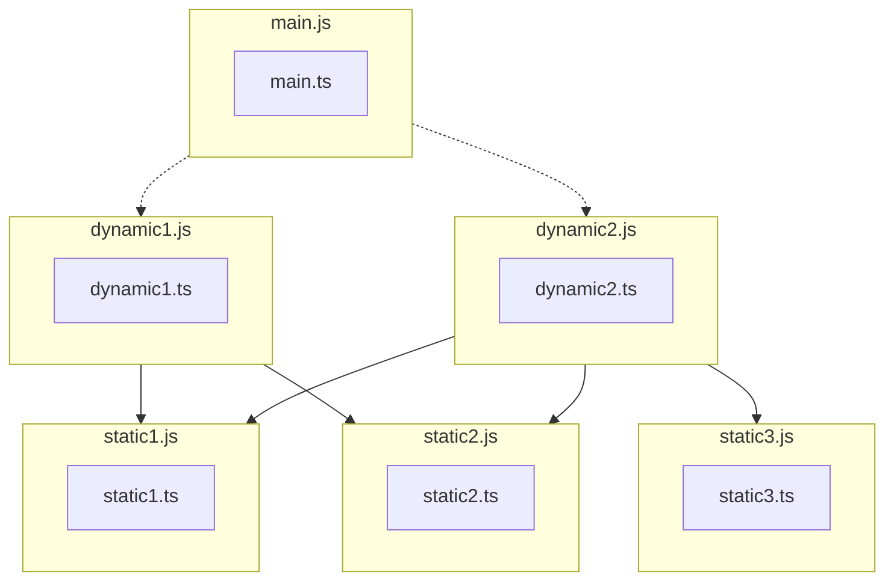

# Architecture and Problem Statement

## The Problem

The Esbuild chunking algorithm considers each dynamic entry point as its own entry point. Because it does not distinguish between entry points, it optimizes each to reduce the amount of code required to load it.



However, in the context of single page applications (SPAs) like Angular, there is only one true entry point (`main.ts`), and the rest of the dynamic entry points cannot load or function outside that context. This means we do not need to optimize for each entry point in isolation, but instead optimize them considering their reachability from the main entry point.



### Transpiled Source

Consider the following source files:

```typescript
// main.ts
import('./dynamic1');
import('./dynamic2');

// dynamic1.ts
import './static1';
import './static2';
import './static3';

// dynamic2.ts
import './static1';
import './static2';
import './static3';
```

When bundled by esbuild, the output becomes fragmented:



This fragmentation can result in hundreds of small files being requested at application startup.

## The Solution: Advanced Chunking Strategies

`@rx-angular/rebundle` applies several strategies to merge these fragmented chunks back into logical groupings.

### Reachability Strategy

The reachability strategy attempts to optimize the bundle without any significant increase in bundle size. It traverses the imports and merges chunks based on the paths from which the code is reachable. If a set of static files is only ever reached via a specific dynamic route, they can be merged into that route's chunk.

### Bundling using Import Attributes

We can use import attributes to give the bundler hints about how to chunk certain dynamic imports.

#### `chunkName` attribute

Dynamic Imports marked with the `chunkName` attribute will generate a new named chunk. All imports of the marked file will end up in this chunk (e.g. `<chunkName>-XYZ.js`).

#### `include: 'withSharedDeps'` (Default)

If `withSharedDeps` is used for `include`, the generated chunk will include shared dependencies of dynamic imports marked with the same `chunkName`.

```typescript
// main.ts
import('./dynamic1', { with: { chunkName: 'common' } });
import('./dynamic2', { with: { chunkName: 'common' } });
```

This merges `static1` and `static2` into `common.js`, while `static3` stays isolated or goes into `dynamic2.js`.

#### `include: 'withAllDeps'`

If `withAllDeps` is used, the generated chunk will include all dependencies of dynamic imports marked with the same `chunkName`, even if they aren't strictly shared.

```typescript
// main.ts
import('./dynamic1', { with: { chunkName: 'common' } });
import('./dynamic2', { with: { chunkName: 'common', include: 'withAllDeps' } });
```

This merges all static dependencies (`static1`, `static2`, `static3`) into `common.js`.

### Rolldown Considerations

While rolldown can achieve some of this by default, configuring it to handle Angular's rebundling pipeline seamlessly requires analyzing the module graph and applying these advanced chunking strategies dynamically.

## Bundle Issues Tracked

To ensure long-term stability and optimization, the following considerations should be monitored:

- **Chunk Size:** Ensure max size limits are respected so we don't end up with massive single chunks.
- **Cache Invalidation:** Aggressive merging can lead to frequent cache busting.
- **Typechecking:** Import attributes should ideally be typed correctly in the global scope.
