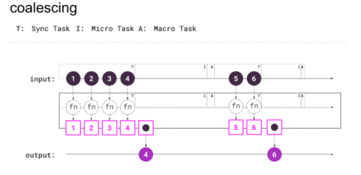

# @rx-angular/template

[](https://circleci.com/gh/BioPhoton/rx-angular)
[](https://www.npmjs.com/@rx-angular/template)

## Reactive Template Rendering for Angular

@rx-angular/template is a comprehensive toolset for fully reactive rendering in Angular.
It leverages the latest Browser APIs (while still being backwards compatible) to maximize the rendering performance and thus
the user experience of your angular application.
The functionalities are provided by
structural directives, pipes, RxJS operators, or imperative functions to manage the rendering in Angular.


## Description

**@rx-angular/template** is nothing less than a revolution in `ChangeDetection` for angular applications.
Developers are provided with tools for high-performance rendering, which are operated by a broad and intuitive API.

The [LetDirective (`*rxLet`)](#LetDirective) & [PushPipe (`push`)](#PushPipe) focus on template rendering,
the coordination and optimization of `ChangeDetection` cycles. While the `PushPipe` is a
straight **drop in replacement** for the `AsyncPipe (async)`, the `LetDirective` will often provide a more
convenient way of managing reactive sources and lazy rendering of the view.

Using those with the default strategy ([Local Strategy](#Local Strategy)) should already improve the rendering performance of
your application by a decent amount.

The applied optimization behavior is fully customizable by using built-in or
custom provided (_coming soon_) [RenderStrategies](#RenderStrategies).  
However, `RenderStrategies` are also meant to be as a tool developers can interact with inside
their components, giving you an even broader access to the rendering mechanisms of your application.
The API comes with imperative as well as reactive ways to manage renderings.
By default, changes get scoped, coalesced and scheduled using the latest browser APIs.
Beyond to the use of the scheduling APIs in the browser, local rendering of components is also
key for a smooth experience.

Additionally, @rx-angular/template provides some neat optimization tools such as [unpatch](#UnpatchEventsDirective)
or [viewport-prio](#Viewport Priorization) which in general will give you more control about what changes are
leading to re-renderings.

Although we give our best to provide the most simple developer experience possible, some things
need to be known if you want to master the rendering of your angular application.

If you plan to improve your rendering performance to the maximum possible, there
are several techniques that need to be known and considered.

Topics you should investigate:

- Coalescing
- Scoped Coalescing
- Scheduling
- usage of directives, pipes, and operators
- the rendering strategies

## Install

`npm install --save @rx-angular/template`  
or  
`yarn add @rx-angular/template`

## Current Situation

### Binding Reactive Sources

The current way of binding _reactive_ sources to a view in angular looks like that:

```html
{{ heroData$ | async }}
<ng-container *ngIf="heroData$ | async as data">{{data | json}}</ng-container>
<hero-list-component [value]="heroData$ | async"></hero-list-component>
```

The problem is, `async` pipe flags the component and all its **ancestors** as dirty.
It needs zone.js microtask queue to exhaust until `ApplicationRef.tick` is called to render all dirty marked
components from top to bottom.

This more often than not causes a huge amount of unnecessary re-renderings of components which didn't
had any changes in the first place.

While this approach is pretty convenient to use,
since the rendering gets brute-forced on any change, making REALLY sure anything gets re-rendered.
Heavy dynamic and interactive UIs suffer pretty bad from `zone.js ChangeDetection`.
This can lead to very bad performance or even unusable applications.
Furthermore, it turns out the `async` pipe does not work in zone-less environments as well as many third party
software as well.

The comprehensive toolset of `@rx-angular/template` solves most of those issues with or without `zone.js`.

### NgZone

`NgZone` assumes that DOM events like click, resize, focus, blur (+ `EventEmitters`, `setTimeOut`, `Promise.resolve()`, etc)
are always used by developers to dispatch actions which leads to state mutation. If one of those
get bound to/executed, a re-rendering for your component and all **ancestors** will be scheduled by NgZone.

The current way of binding events to DOM:

```html
<button (click)="doStuff($event)">click me</button>
<!-- a click will automagically schedule a re-render for you -->
```

One could argue this is helpful in way that it automagically renders changes for you.

However, this is not always the case. And we came to the conclusion this is not a good approach by any means.
In reality you will encounter a **massive** amount of over-renderings of pretty much any of your components.
This can be irrelevant on hardware accelerated powerhouses, user experiences will suffer a lot on lower end devices.

On top of that, we think that this technique inserts way too much _magic_ in the framework itself as well as keeping away
crucial control over what happens in your application.

You can play around in the `demo apps (expermiments, template-demo)` if you want
to get a clearer picture of what actually happens.

(info of michael hlady talks?)

The long term goal should be to eliminate NgZone by using the `'noop' NgZone`. However, this is only in a few scenarios
a feasible option. Most third party libraries
rely on some `NgZone` callbacks (including `@angular/components` & `@angular/cdk` pretty heavily). Some of the components will
stop working at all after using `'noop' NgZone`.

To encounter those issues at least partially, @rx-angular/template provides easy to use optimization tools
such as the [[unpatch] directive](#UnpatchEventsDirective).

Nevertheless, if you know what you do and want to build a render performance critical application, `@rx-angular/template`
is the perfect candidate for being its base.

Some further information about NgZone (zone.js):

- [zone-js-references](https://gist.github.com/BioPhoton/090684defbe926f398e8d3d4b0b1f0e1)
- [zone.js MODULE.md](https://github.com/angular/zone.js/blob/master/MODULE.md)

## Included Features

- [Directives](#Directives)
  - [LetDirective (\*rxLet)](#LetDirective)
  - [Viewport Priority (viewport-prio)](#Viewport Priority)
  - [UnpatchEventsDirective (unpatch)](#UnpatchEventsDirective)
- Pipes
  - [PushPipe (push)](#PushPipe)
- [Render Strategies](#RenderStrategies)
- Helpers
  - RxJS Operators
  - Static Functions

## Concepts

### Coalescing

Coalescing, in this very manner, means _collecting all events_ in the same
[EventLoop](https://developer.mozilla.org/de/docs/Web/JavaScript/EventLoop) tick,
that would cause a re-rendering and execute **re-rendering only once**.



### Scoped Coalescing

Scoped Coalescing, in addition, means **grouping the collected events** by a specific context.
E.g. the **component** from which the re-rendering was initiated.

### Scheduling

Coalescing provides us a way to gather multiple re-renderings to a single point of execution. Scheduling in this
the case means searching for the very **optimized** point in time when to really _execute rendering_.


## Directives

### LetDirective

The `*rxLet` directive serves a convenient way of binding observables to a view context. Furthermore, it helps
you structure view related models into view context scopes (dom elements scope).
Under the hood, it leverages a `RenderStrategy` which in turn takes care of optimizing the `ChangeDetection`
of your component.

The rendering behavior can be configured per LetDirective instance by using the strategy `@Input()`.
You find more information about [`RenderStrategies`](#RenderStrategies) in the sections below.

Other Features:

- lazy rendering
- binding is always present (`*ngIf="truthy$"`) ???
- it takes away multiple usages of the `async` or `push` pipe
- a unified/structured way of handling null, undefined or error
- distinct same values in a row skip not needed re-renderings

The current way of binding an observable in angular applications to the view looks like that:

```html
<ng-container *ngIf="heroData$ | async as data">
  <hero-search [term]="data.searchTerm"> </hero-search>
  <hero-list-component [heroes]="data.heroes"> </hero-list-component>
</ng-container>
```

`*ngIf` is also interfering with rendering. In case of any false
value (e.g. `0`), the component would get detached from the dom.

View binding with `*rxLet`:

```html
<ng-container *rxLet="heroData$; let data">
  <hero-search [term]="data.searchTerm"> </hero-search>
  <hero-list-component [heroes]="data.heroes"> </hero-list-component>
</ng-container>
```

Structure your view into multiple lazy loading components:

```html
<hero-search *rxLet="searchData$; let s" [term]="s.term"> </hero-search>
<hero-list-component *rxLet="listData$; let l" [heroes]="l.heroes">
</hero-list-component>
```

Using different render strategies:

```html
<hero-search *rxLet="searchData$; let s; strategy: 'global'" [term]="s.term">
</hero-search>
<hero-list-component *rxLet="listData$; let l" [heroes]="l.heroes">
</hero-list-component>
```

The `*rxLet` Directive will render its template and manage `ChangeDetection` after it got an initial value.
So if the incoming `Observable` emits it's value lazy (e.g. data coming from `Http`), your template will be
rendered lazy as well. This can very positively impact the initial render performance of your application.

In addition to that, it provides us information on the observable context.
We can track:

- next value
- error value
- base state

```html
<ng-container *rxLet="heroData$; let data; let e = $error, let c = $complete">
  <hero-list-component *ngIf="!e && !c" [heroes]="data.heroes">
  </hero-list-component>
  <ng-container *ngIf="e">
    There is an error: {{e}}
  </ng-container>
  <ng-container *ngIf="c">
    Observable completed: {{c}}
  </ng-container>
</ng-container>
```

### UnpatchEventsDirective

The `unpatch` directive helps developers to partially deactivate `NgZone`, as well as getting rid
of unnecessary renderings through zones `addEventListener` patches.
It can be used on any element you apply to event bindings.

The current way of binding events to DOM:

```html
<div (mousemove)="doStuff($event)">Hover me</div>
<!-- every mousemove will automatically schedule a re-render for you -->
```

The problem is that every event registered via `()`, e.g. `(mousemove)` (or custom `@Output()`)
marks the component and all its ancestors as dirty and re-renders the whole component tree. [readmore](#NgZone)

So even if your eventListener is not related to any change at all, your app will re-render the whole component tree.
This can lead to very bad user experiences, especially if you work with frequently fired events such as `mousemove`.

The `unpatch` directive solves this problem in a convenient way:

```html
<button [unpatch] (click)="triggerSomeMethod($event)">click me</button>
<button
  [unpatch]="['mousemove']"
  (mousemove)="doStuff2($event)"
  (click)="doStuff($event)"
>
  click or hover me
</button>
```

Included Features:

- by default un-patch all registered listeners of the host it is applied on
- un-patch only a specified set of registered event listeners
- works zone independent (it directly checks the widow for patched APIs and un-patches them without the use of `runOutsideZone` which brings more performance)
- Not interfering with any logic executed by the registered callback

#### Current list of unpatched events

```typescript
export const zonePatchedEvents = [
  'scroll',
  'mousedown',
  'mouseenter',
  'mouseleave',
  'mousemove',
  'mouseout',
  'mouseover',
  'mouseup',
  'load',
  'pointerup',
  'change',
  'blur',
  'focus',
  'click',
  'contextmenu',
  'drag',
  'dragend',
  'dragenter',
  'dragleave',
  'dragover',
  'dragstart',
  'drop',
  'input'
];
```

_more coming soon_:

- `EventEmitter` -> custom `@Output()`
- `(@animationTrigger.start)` & `(@animationTrigger.done)`
- ...

### Viewport Priority

_coming soon_

## PushPipe

The `push` pipe serves as a drop-in replacement for angulars built-in `async` pipe.
Just like the `*rxLet` Directive, it leverages a `RenderStrategy` under the hood which
in turn, takes care of optimizing the `ChangeDetection` of your component.

The rendering behavior can be configured per PushPipe instance using the strategy parameter.
You find more information about [`RenderStrategies`](#RenderStrategies) in the sections below.

Usage in the template

```html
<hero-search [term]="searchTerm$ | push"> </hero-search>
<hero-list-component [heroes]="heroes$ | push"> </hero-list-component>
```

Using different strategies

```html
<hero-search [term]="searchTerm$ | push: 'global'"> </hero-search>
<hero-list-component [heroes]="heroes$ | push: 'global'"> </hero-list-component>
```

Other Features:

- lazy rendering (see [LetDirective](#LetDirective))
- Take observables or promises, retrieve their values and render the value to the template
- a unified/structured way of handling null, undefined or error
- distinct same values in a row skip not needed re-renderings

## RenderStrategies

The `RenderStrategies` can be seen as the _core_ of the performance optimization layer. They utilize all
[`Concepts`](#Concepts) explained above in order to provide a streamlined and focused API to master
angular rendering and `ChangeDetection`.

### Usage

Use the corresponding `RenderStrategy#name` as parameter or Input with the `PushPipe` or `LetDirective`.
By default, they will use the [Local Strategy](#Local Strategy).

```html
<div *rxLet="list$; let list; strategy: 'global'"></div>
<hero-list heroes="list$ | push: 'global'"></hero-list>
```

When you want to handle `ChangeDetection` manually inside a `Component`, `Directive` or `Service`, you can
simply use the built-in `StrategySelection`.

_imperative approach_

```typescript
import { Component, ChangeDetectorRef } from '@angular/core';
import { getStrategies } from '@rx-angular/template';

@Component()
export class PerformanceAwareComponent {
  constructor(private cdRef: ChangeDetectorRef) {
    const strategies = getStrategies({ cdRef });
    // now select your desired strategy:
    const detachStrategy = strategies.detach;
    // schedule a re-render:
    detachStrategy.scheduleCD();
    // render synchronously:
    detachStrategy.renderMethod();
  }
}
```

### Built-in Strategies


#### Native Strategy

This strategy mirrors Angular's built-in `async` pipe.
This means for every emitted value `ChangeDetectorRef#markForCheck` is called.

| Name     | ZoneLess VE/I | Render Method VE/I | Coalescing VE/I |
| -------- | ------------- | ------------------ | --------------- |
| `native` | ❌/❌         | mFC / mFC          | ❌              |

#### Noop

Noop Strategy

This strategy does nothing. It serves for debugging purposes or as a fine-grained performance optimization tool.
Use it with caution, since it stops `ChangeDetection` completely.

| Name   | ZoneLess VE/I | Render Method VE/I | Coalescing VE/I |
| ------ | ------------- | ------------------ | --------------- |
| `noop` | ❌/❌         | no rendering       | ❌              |

#### Global Strategy

This strategy is rendering the application root and
all its children that are on a path
that is marked as dirty or has components with `ChangeDetectionStrategy.Default`.

| Name     | ZoneLess VE/I | Render Method VE/I | Coalescing |
| -------- | ------------- | ------------------ | ---------- |
| `global` | ❌/✔️         | mFC / ɵMD          | ❌         |

#### Local Strategy

This strategy is rendering the actual component and
all it's **children** that are on a path
that is marked as dirty or has components with `ChangeDetectionStrategy.Default`.

As detectChanges is synchronous and has no built-in coalescing of rendering
like `ChangeDetectorRef#markForCheck` or `ɵmarkDirty` have, we have to apply our own coalescing.
It is also _scoped_ on the component level. (see [Concepts](#Concepts) for more information)

| Name    | ZoneLess VE/I | Render Method VE/I | Coalescing/Schedule    |
| ------- | ------------- | ------------------ | ---------------------- |
| `local` | ✔️/✔️         | dC / dC            | micro + animationFrame |

#### Detach Strategy

The Detach Strategy shares its behavior with the **Local Strategy** . It can be seen as
the **Local Strategies** more aggressive brother. Instead of just rendering scheduled changes,
it will also `detach` (`ChangeDetectorRef#detach`) this very `ChangeDetectorRef` from the detection cycle.
Use this strategy at your own risk. It provides absolute **maximum performance** since your `Component` is
effectively resilient against re-renderings coming from any other source than itself. But it will come with
some down sights as you will see when using it :). Have fun!!

| Name     | ZoneLess VE/I | Render Method VE/I | Coalescing             |
| -------- | ------------- | ------------------ | ---------------------- |
| `detach` | ✔️/✔️         | dC / ɵDC           | micro + animationFrame |

### Custom Strategies

_coming soon_
