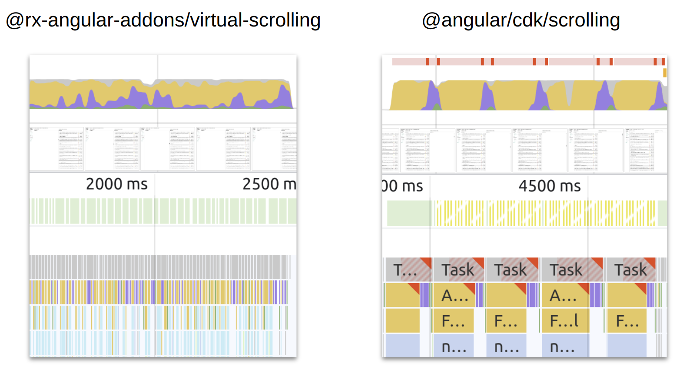

# RxVirtualScroll

A **high performance** alternative to [`@angular/cdk/scrolling`](https://material.angular.io/cdk/scrolling/) virtual scrolling implementation.



Instead of rendering every item provided, `rxVirtualFor` only renders what is currently visible to the user, thus providing
excellent runtime performance for huge sets of data.

The technique to render items is comparable to the one used by twitter and
explained in great detail by @DasSurma in his blog post about the
[complexities of infinite scrollers](https://developer.chrome.com/blog/infinite-scroller/).

"Each recycling of a DOM element would normally relayout the entire runway which would bring us well below our target
of 60 frames per second. To avoid this, we are taking the burden of layout onto ourselves and use absolutely positioned
elements with transforms." (@DasSurma)

# TOC

- [Usage](#usage)
- [Demo](#demo)
- [Features](#features)
- [Missing Features (Roadmap)](#missing-features-roadmap)
- [Docs](#docs)
  - [RxVirtualFor](#rxvirtualfor)
  - [RxVirtualScrollViewportComponent](#rxvirtualfor)
  - [RxVirtualScrollStrategy](#rxvirtualscrollstrategy)
  - [Configuration](#configuration)
- [Performance Benchmarks](#performance-benchmarks)
- [Version Compatibility](#version-compatibility)

## Usage

```ts
import {
  FixedSizeVirtualScrollStrategy,
  RxVirtualScrollingModule,
} from '@rx-angular/template/experimental/virtual-scrolling';

@NgModule({
  imports: [RxVirtualScrollingModule, FixedSizeVirtualScrollStrategy],
})
export class MyModule {}
```

```html
<rx-virtual-scroll-viewport>
  <div [itemSize]="50" *rxVirtualFor="let hero of heroes$;">
    <div>
      <div><strong>{{ hero.name }}</strong></div>
      <div>{{ hero.id }}</div>
      <div>{{ hero.description }}</div>
    </div>
  </div>
</rx-virtual-scroll-viewport>
```

## Demo

Check out the [Demo Application](https://hoebbelsb.github.io/rxa-virtual-scroll/). You can play around with
all pre-packaged ScrollStrategies as well as control the majority of inputs.

## Features

**DX Features**

- reduces boilerplate (multiple `async` pipe's)
- works also with static variables `*rxVirtualFor="let i of myData"`
- Immutable as well as mutable data structures (`trackBy`)
- Notify when rendering of templates is finished (`renderCallback`)

**Performance Features**

- lazy template creation (done by [Render Strategies](https://www.rx-angular.io/docs/cdk/render-strategies))
- non-blocking rendering of lists [Concurrent Strategies](https://www.rx-angular.io/docs/cdk/render-strategies/strategies/concurrent-strategies)
- configurable frame budget (defaults to 60 FPS)
- Super efficient layouting with css transformations
- Scoped layouting with css containment
- Define a viewCache in order to re-use views instead of re-creating them
- triggers change-detection on `EmbeddedView` level
- Zone-agnostic, opt-out of `NgZone` with `patchZone`
- 3 Configurable `RxVirtualScrollStrategy` providing the core logic to calculate the viewRange and position DOM
  Nodes
  - `FixedSizeVirtualScrollStrategy`
  - `AutosizeVirtualScrollStrategy`
  - `DynamicSizeVirtualScrollStrategy`

## Missing Features (Roadmap)

The following section describes features that are currently not implemented, but planned.

### Migrate to latest angular

Right now, this library is built with angular version 12 in order to have the first version being compatible with `@angular/core: >= 12`.
It is planned to migrate to the latest angular version and adapt to new features like standalone components, provider functions and standalone components.

### Support other orientations

Right now, the `@rx-angular/template/experimental/virtual-scrolling` package only supports vertical scrolling. In the future, it should also
be able to support horizontal scrolling.

### Tombstones

Tombstones, skeletons or placeholder templates are a nice way to improve the scrolling performance, especially when the actual views being rendered
are heavy and take a long time to create. Especially for the autosized strategy this can increase the visual stability and runtime performance a lot.

The concept is described in the article [Complexities of an infinite scroller](https://developer.chrome.com/blog/infinite-scroller/#tombstones)
and visible in the corresponding [demo](http://googlechromelabs.github.io/ui-element-samples/infinite-scroller/).

# Docs

The `@rx-angular/template/experimental/virtual-scrolling` package can be seen as a high performant competitor of the
official `@angular/cdk/scrolling`.
The API is heavily inspired by `@angular/cdk/scrolling` and is divided into multiple
core components which have to be glued together:

- `RxVirtualViewRepeater`, implemented by `RxVirtualFor`
- `RxVirtualScrollViewport`, implemented by `RxVirtualScrollViewportComponent`
- `RxVirtualScrollStrategy`, implemented by `AutosizeVirtualScrollStrategy`, `FixedSizeVirtualScrollStrategy` & `DynamicSizeVirtualScrollStrategy`

## API

### RxVirtualFor

The `*rxVirtualFor` structural directive implements the `RxVirtualViewRepeater` and is responsible to create, update, move and remove views
from the bound data.
As [`RxFor`](https://www.rx-angular.io/docs/template/api/rx-for-directive), `RxVirtualFor` treats each child template as single renderable unit.
By default the change detection of the child templates get prioritized, scheduled and executed by leveraging [`RenderStrategies`](https://www.rx-angular.io/docs/cdk/render-strategies) under the hood.
This technique enables non-blocking rendering of lists and can be referred to as concurrent mode.

Read more about the concurrent mode in the [concurrent strategies section](https://www.rx-angular.io/docs/cdk/render-strategies/strategies/concurrent-strategies) in the `RxAngular` docs.

#### Inputs

| Input            | Type                                                               | description                                                                                                                                                                                                                                                                                                                                         |
| ---------------- | ------------------------------------------------------------------ | --------------------------------------------------------------------------------------------------------------------------------------------------------------------------------------------------------------------------------------------------------------------------------------------------------------------------------------------------- |
| `trackBy`        | `keyof T` or `(index: number, item: T) => any`                     | Identifier function for items. `rxVirtualFor` provides a shorthand where you can name the property directly.                                                                                                                                                                                                                                        |
| `patchZone`      | `boolean`                                                          | _default: `true`_ if set to `false`, the `RxVirtualForDirective` will operate out of `NgZone`. See [NgZone optimizations](https://www.rx-angular.io/docs/template/performance-issues/ngzone-optimizations)                                                                                                                                          |
| `parent`         | `boolean`                                                          | _default: `false`_ if set to `false`, the `RxVirtualForDirective` won't inform its host component about changes being made to the template. More performant, `@ViewChild` and `@ContentChild` queries won't work. [Handling view and content queries](https://www.rx-angular.io/docs/template/performance-issues/handling-view-and-content-queries) |
| `strategy`       | `Observable<RxStrategyNames \ string> \ RxStrategyNames \ string>` | _default: `normal`_ configure the `RxStrategyRenderStrategy` used to detect changes. [Render Strategies](https://www.rx-angular.io/docs/cdk/render-strategies)                                                                                                                                                                                      |
| `renderCallback` | `Subject<U>`                                                       | giving the developer the exact timing when the `RxVirtualForDirective` created, updated, removed its template. Useful for situations where you need to know when rendering is done.                                                                                                                                                                 |
| `viewCacheSize`  | `number`                                                           | _default: `20`_ Controls the amount if views held in cache for later re-use when a user is scrolling the list If this is set to 0, `rxVirtualFor` won't cache any view, thus destroying & re-creating very often on scroll events.                                                                                                                  |

#### Context Variables

The following context variables are available for each template:

**Static Context Variables (mirrored from `ngFor`)**

| Variable Name | Type      | description                                          |
| ------------- | --------- | ---------------------------------------------------- |
| `$implicit`   | `T`       | the default variable accessed by `let val`           |
| `index`       | `number`  | current index of the item                            |
| `count`       | `number`  | count of all items in the list                       |
| `first`       | `boolean` | true if the item is the first in the list            |
| `last`        | `boolean` | true if the item is the last in the list             |
| `even`        | `boolean` | true if the item has on even index (index % 2 === 0) |
| `odd`         | `boolean` | the opposite of even                                 |

**Reactive Context Variables**

| Variable Name | Type                                                           | description                                                                                                                                                                                                       |
| ------------- | -------------------------------------------------------------- | ----------------------------------------------------------------------------------------------------------------------------------------------------------------------------------------------------------------- |
| `item$`       | `Observable<T>`                                                | the same value as $implicit, but as `Observable`                                                                                                                                                                  |
| `index$`      | `Observable<number>`                                           | index as `Observable`                                                                                                                                                                                             |
| `count$`      | `Observable<number>`                                           | count as `Observable`                                                                                                                                                                                             |
| `first$`      | `Observable<boolean>`                                          | first as `Observable`                                                                                                                                                                                             |
| `last$`       | `Observable<boolean>`                                          | last as `Observable`                                                                                                                                                                                              |
| `even$`       | `Observable<boolean>`                                          | even as `Observable`                                                                                                                                                                                              |
| `odd$`        | `Observable<boolean>`                                          | odd as `Observable`                                                                                                                                                                                               |
| `select`      | `(keys: (keyof T)[], distinctByMap) => Observable<Partial<T>>` | returns a selection function which accepts an array of properties to pluck out of every list item. The function returns the selected properties of the current list item as distinct `Observable` key-value-pair. |

**Use the context variables**

```html
<rx-virtual-scroll-viewport [itemSize]="50">
  <div
    *rxVirtualFor="
      let item of observableItems$;
      let count = count;
      let index = index;
      let first = first;
      let last = last;
      let even = even;
      let odd = odd;
      trackBy: trackItem;
    "
  >
    <div>{{ count }}</div>
    <div>{{ index }}</div>
    <div>{{ item }}</div>
    <div>{{ first }}</div>
    <div>{{ last }}</div>
    <div>{{ even }}</div>
    <div>{{ odd }}</div>
  </div>
</rx-virtual-scroll-viewport>
```

### RxVirtualScrollViewportComponent

Container component comparable to CdkVirtualScrollViewport acting as viewport for `*rxVirtualFor` to operate on.
Its main purpose is to implement the `RxVirtualScrollViewport` interface as well as maintaining the scroll runways'
height in order to give the provided `RxVirtualScrollStrategy` room to position items. Furthermore, it will gather and forward
all events to the consumer of `rxVirtualFor`.

#### Outputs

| Output                | Type                                         | description                                                                                                                                                                                                                                                                                                                                                     |
| --------------------- | -------------------------------------------- | --------------------------------------------------------------------------------------------------------------------------------------------------------------------------------------------------------------------------------------------------------------------------------------------------------------------------------------------------------------- |
| `viewRange`           | `ListRange: { start: number; end: number; }` | The range to be rendered by `*rxVirtualFor`. This value is determined by the provided `RxVirtualScrollStrategy`. It gives the user information about the range of items being actually rendered to the DOM. Note this value updates before the `renderCallback` kicks in, thus it is only in sync with the DOM when the next `renderCallback` emitted an event. |
| `scrolledIndexChange` | `number`                                     | The index of the currently scrolled item. The scrolled item is the topmost item actually being visible to the user.                                                                                                                                                                                                                                             |

### RxVirtualScrollStrategy

The `RxVirtualScrollStrategy` is responsible for positioning the created views on the viewport.
The three pre-packaged scroll strategies share similar concepts for layouting views.
All of them provide a twitter-like virtual-scrolling implementation, where views are positioned absolutely and transitioned by
using css `transforms`.
They also share two inputs to define the amount of views to actually render on the screen.

| Input                 | Type     | description                                                                      |
| --------------------- | -------- | -------------------------------------------------------------------------------- |
| `runwayItems`         | `number` | _default: `10`_ The amount of items to render upfront in scroll direction        |
| `runwayItemsOpposite` | `number` | _default: `2`_ The amount of items to render upfront in reverse scroll direction |

#### FixedSizeVirtualScrollStrategy

The `FixedSizeVirtualScrollStrategy` positions views based on a fixed size per item. It is comparable to `@angular/cdk/scrolling` `FixedSizeVirtualScrollStrategy`,
but with a high performant layouting technique.

[Demo](https://hoebbelsb.github.io/rxa-virtual-scroll/#/demos/fixed-size)

The default size can be configured directly as `@Input('itemSize')`.

**Example**

```ts
// my.component.ts
import {
  FixedSizeVirtualScrollStrategyModule,
  RxVirtualScrollingModule,
} from '@rx-angular/template/experimental/virtual-scrolling';

@Component({
  /**/,
  standalone: true,
  imports: [FixedSizeVirtualScrollStrategyModule, RxVirtualScrollingModule]
})
export class MyComponent {
  // all items have the height of 50px
  itemSize = 50;

  items$ = inject(DataService).getItems();
}
```

```html
<rx-virtual-scroll-viewport [itemSize]="itemSize">
  <div class="item" *rxVirtualFor="let item of items$;">
    <div>{{ item.id }}</div>
    <div>{{ item.content }}</div>
    <div>{{ item.status }}</div>
    <div>{{ item.date | date }}</div>
  </div>
</rx-virtual-scroll-viewport>
```

#### DynamicSizeVirtualScrollStrategy

The `DynamicSizeVirtualScrollStrategy` is very similar to the `AutosizeVirtualScrollStrategy`. Instead of hitting the DOM, it calculates the size
based on a user provided function of type `(item: T) => number`. Because it doesn't have to interact with the DOM in order to position views,
the `DynamicSizeVirtualScrollStrategy` has a better runtime performance compared to the `AutosizeVirtualScrollStrategy`.

This strategy is very useful for scenarios where you display different kind of templates, but already know the dimensions of
them.

[Demo](https://hoebbelsb.github.io/rxa-virtual-scroll/#/demos/dynamic-size)

**Example**

```ts
// my.component.ts
import {
  DynamicSizeVirtualScrollStrategyModule,
  RxVirtualScrollingModule,
} from '@rx-angular/template/experimental/virtual-scrolling';

@Component({
  /**/,
  standalone: true,
  imports: [DynamicSizeVirtualScrollStrategyModule, RxVirtualScrollingModule]
})
export class MyComponent {
  // items with a description have 120px height, others only 50px
  dynamicSize = (item: Item) => (item.description ? 120 : 50);

  items$ = inject(DataService).getItems();
}
```

```html
<!--my.component.html-->
<rx-virtual-scroll-viewport [dynamic]="dynamicSize">
  <div class="item" *rxVirtualFor="let item of items$;">
    <div>{{ item.id }}</div>
    <div>{{ item.content }}</div>
    <div>{{ item.status }}</div>
    <div>{{ item.date | date }}</div>
    <div *ngIf="item.description">{{ item.description }}</div>
  </div>
</rx-virtual-scroll-viewport>
```

#### AutosizeVirtualScrollStrategy

The `AutosizeVirtualScrollStrategy` is able to render and position
items based on their individual size. It is comparable to `@angular/cdk/experimental` `AutosizeVirtualScrollStrategy`, but with
a high performant layout technique, better visual stability and added features.
Furthermore, the `AutosizeVirtualScrollStrategy` is leveraging the `ResizeObserver` in order to detect size changes for each individual
view rendered to the DOM and properly re-position accordingly.

For views it doesn't know yet, the `AutosizeVirtualScrollStrategy` anticipates a certain size in order to properly size the runway.
The size is determined by the `@Input('tombstoneSize')` and defaults to `50`.

In order to provide top runtime performance the `AutosizeVirtualScrollStrategy` builds up caches that
prevent DOM interactions whenever possible. Once a view was visited, its properties will be stored instead of re-read from the DOM
again as this can potentially lead to unwanted forced reflows.

[Demo](https://hoebbelsb.github.io/rxa-virtual-scroll/#/demos/autosize)

**Example**

```ts
// my.component.ts
import {
  AutosizeVirtualScrollStrategyModule,
  RxVirtualScrollingModule,
} from '@rx-angular/template/experimental/virtual-scrolling';

@Component({
  /**/,
  standalone: true,
  imports: [AutosizeVirtualScrollStrategyModule, RxVirtualScrollingModule]
})
export class MyComponent {
  items$ = inject(DataService).getItems();
}
```

```html
<rx-virtual-scroll-viewport autosize>
  <div class="item" *rxVirtualFor="let item of items$;">
    <div>{{ item.id }}</div>
    <div>{{ item.content }}</div>
    <div>{{ item.status }}</div>
    <div>{{ item.date | date }}</div>
  </div>
</rx-virtual-scroll-viewport>
```

## Configuration

#### RX_VIRTUAL_SCROLL_DEFAULT_OPTIONS

By providing a `RX_VIRTUAL_SCROLL_DEFAULT_OPTIONS` token, you can pre-configure default settings for
the directives of the `@rx-angular/template/experimental/virtual-scrolling` package.

```ts
import { RX_VIRTUAL_SCROLL_DEFAULT_OPTIONS } from '@rx-angular/template/experimental/virtual-scrolling';

@NgModule({
  providers: [{
      provide: RX_VIRTUAL_SCROLL_DEFAULT_OPTIONS,
      useValue: { // should be of type `RxVirtualScrollDefaultOptions`
        runwayItems: 50,
        // turn off cache by default
        viewCacheSize: 0
      }
  }]
})
```

#### Default Values

```ts
/* determines how many templates can be cached and re-used on rendering */
const DEFAULT_VIEW_CACHE_SIZE = 20;
/* determines how many views will be rendered in scroll direction */
const DEFAULT_ITEM_SIZE = 50;
/* determines how many views will be rendered in the opposite scroll direction */
const DEFAULT_RUNWAY_ITEMS = 10;
/* default item size to be used for scroll strategies. Used as tombstone size for the autosized strategy */
const DEFAULT_RUNWAY_ITEMS_OPPOSITE = 2;
```

#### RxVirtualScrollDefaultOptions

```ts
export interface RxVirtualScrollDefaultOptions {
  /* determines how many templates can be cached and re-used on rendering, defaults to 20 */
  viewCacheSize?: number;
  /* determines how many views will be rendered in scroll direction, defaults to 15 */
  runwayItems?: number;
  /* determines how many views will be rendered in the opposite scroll direction, defaults to 5 */
  runwayItemsOpposite?: number;
  /* default item size to be used for scroll strategies. Used as tombstone size for the autosized strategy */
  itemSize?: number;
}
```

# Performance Benchmarks

As this library is a direct competitor of [`@angular/cdk/scrolling`](https://material.angular.io/cdk/scrolling/overview),
this section discusses not only performance differences, but also feature availability.

Performance recordings are taken from the [Demo Application](https://hoebbelsb.github.io/rxa-virtual-scroll/).
The demo application by default displays lists of `30 000` items.

The scenario that was benchmarked here is scrolling over long distances by using the scroll bar. This scenario
puts the most pressure on the virtual scrollers.

## System Setup

|           |                                                            |
| --------- | ---------------------------------------------------------- |
| OS        | `Pop!_OS 22.04 LTS`                                        |
| Browser   | `Chromium Version 112.0.5615.49 (Official Build) (64-bit)` |
| Processor | `Intel® Core™ i7-9750H CPU @ 2.60GHz × 12`                 |

## Different Layout techniques

The RxVirtualScrolling approach to layout items is to absolutely position every view inside the viewport. Therefore, it sets the `transform` property for each managed item.
The CDK approach instead transforms the viewport. The following video showcases the difference.

https://user-images.githubusercontent.com/4904455/231340169-f65efe6c-863d-49e8-9f4f-183bb38e1b2a.mp4

## Fixed Size Strategy

Comparison between [RxAngular FixedSizeVirtualScrollStrategy](#fixedsizevirtualscrollstrategy) and [CdkFixedSizeVirtualScroll](https://material.angular.io/cdk/scrolling/api#CdkFixedSizeVirtualScroll).

[FixedSizeVirtualScrollStrategy comparison Demo](https://hoebbelsb.github.io/rxa-virtual-scroll/#/demos/fixed-size-cdk-compare)

### Features

| Feature           | `@rx-angular/template/experimental/virtual-scrolling` | `@angular/cdk/scrolling` |
| ----------------- | ----------------------------------------------------- | ------------------------ |
| `scrolledIndex$`  | ✅                                                    | ✅                       |
| `scrollToIndex()` | ✅                                                    | ✅                       |

### Performance

**No throttling**

Both solutions do fine without throttling. But, the `CdkFixedSizeVirtualScroll` already struggles with the frame rate. We can already spot `partially presented frames`.
Also, the javascript tasks are taking longer compared to the `RxAngular FixedSizeVirtualScrollStrategy`.

| `@rx-angular/template/experimental/virtual-scrolling`                           | `@angular/cdk/scrolling`                                                        |
| ------------------------------------------------------------------------------- | ------------------------------------------------------------------------------- |
|  |  |

**4x CPU throttling**

With throttling enabled, the `CdkFixedSizeVirtualScroll` already struggles a lot with keeping the frame rate above anything reasonable. Javascript tasks take up to ~160ms (long-tasks) and
the amount of `partially presented frames` increases.
The `RxAngular FixedSizeVirtualScrollStrategy` has no issues whatsoever keeping the frame rate above 30fps on 4x times throttling.

| `@rx-angular/template/experimental/virtual-scrolling`                       | `@angular/cdk/scrolling`                                                    |
| --------------------------------------------------------------------------- | --------------------------------------------------------------------------- |
|  |  |

## Dynamic Size Strategy

Comparison between [RxAngular DynamicSizeVirtualScrollStrategy](#dynamicsizevirtualscrollstrategy) and [CDK AutoSizeVirtualScrollStrategy](https://github.com/angular/components/blob/main/src/cdk-experimental/scrolling/auto-size-virtual-scroll.ts).
As there is no real counterpart to the `DynamicSizeVirtualScrollStrategy`, the comparison was made against the `CDK AutoSizeVirtualScrollStrategy`. This is scroll behavior wise the most comparable
implementation from the cdk package.

[DynamicSizeVirtualScrollStrategy comparison Demo](https://hoebbelsb.github.io/rxa-virtual-scroll/#/demos/dynamic-size-cdk-compare)

### Features

As an experimental package, the `CDK AutoSizeVirtualScrollStrategy` does not emit the current scrollIndex, nor has it a working `scrollToIndex` method implemented.
The `RxAngular DynamicSizeVirtualScrollStrategy` is able to do both! It emits the current valid scrolledIndex and is able to properly scroll to the
correct position based on an index.

| Feature           | `@rx-angular/template/experimental/virtual-scrolling` | `@angular/cdk/scrolling` |
| ----------------- | ----------------------------------------------------- | ------------------------ |
| `scrolledIndex$`  | ✅                                                    | ❌                       |
| `scrollToIndex()` | ✅                                                    | ❌                       |

### Performance

**No throttling**

Both solutions do fine without throttling. But, the `CDK AutoSizeVirtualScrollStrategy` struggles with the frame rate. We can already spot lots of `partially presented frames`.
The `RxAngular DynamicSizeVirtualScrollStrategy` implementation easily maintains a stable framerate around 45fps.

| `@rx-angular/template/experimental/virtual-scrolling`                                   | `@angular/cdk/scrolling`                                                        |
| --------------------------------------------------------------------------------------- | ------------------------------------------------------------------------------- |
|  |  |

**4x CPU throttling**

With throttling enabled, the `CDK AutoSizeVirtualScrollStrategy` struggles a lot with keeping the frame rate above anything reasonable. Javascript tasks take up more than ~160ms (long-tasks) and
the amount of `partially presented frames` increases.
The `RxAngular DynamicSizeVirtualScrollStrategy` has no issues whatsoever keeping the frame rate above 30fps on 4x times throttling. The javascript execution time is still very low, the style
recalculations and layouting phases are increasing, though. This will also depend very much on the actual use case.

| `@rx-angular/template/experimental/virtual-scrolling`                               | `@angular/cdk/scrolling`                                                    |
| ----------------------------------------------------------------------------------- | --------------------------------------------------------------------------- |
|  |  |

## Autosize Strategy

Comparison between [RxAngular AutosizeVirtualScrollStrategy](#autosizevirtualscrollstrategy) and [CDK AutoSizeVirtualScrollStrategy](https://github.com/angular/components/blob/main/src/cdk-experimental/scrolling/auto-size-virtual-scroll.ts).

[AutosizeVirtualScrollStrategy comparison Demo](https://hoebbelsb.github.io/rxa-virtual-scroll/#/demos/autosize-cdk-compare)

### Features

As an experimental package, the `CDK AutoSizeVirtualScrollStrategy` does not emit the current scrollIndex, nor has it a working `scrollToIndex` method implemented.
The `RxAngular AutosizeVirtualScrollStrategy` is able to do both! It emits the current valid scrolledIndex and is able to properly scroll to the
correct position based on an index.

| Feature           | `@rx-angular/template/experimental/virtual-scrolling` | `@angular/cdk/scrolling` |
| ----------------- | ----------------------------------------------------- | ------------------------ |
| `scrolledIndex$`  | ✅                                                    | ❌                       |
| `scrollToIndex()` | ✅                                                    | ❌                       |

### Performance

**No throttling**

For the `CDK AutoSizeVirtualScrollStrategy`, the same is true as for the comparison vs. the `DynamicSizeVirtualScrollStrategy`.
The `RxAngular AutoSizeVirtualScrollStrategy` implementation easily maintains a stable framerate of 60fps. You see the reason why it can maintain this framerate in the
comparison flameshots. The AutoSizeVirtualScrollStrategy puts all the layouting work into the RxAngular scheduler queue which will keep the framebudget for us.
For each inserted view, the `AutoSizeVirtualScrollStrategy` will cause a forced reflow as it immediately reads its dimensions. It sounds like a disadvantage, but in reality
the scrolling performance benefits from this approach. Anyway, that's why we such heavy `rendering` peaks (purple color).
Nodes that were visited once are not queried again, scrolling the same path twice will differ in runtime performance. All consequent attempts should be as fast as the fixed or dynamic
size implementations.

| `@rx-angular/template/experimental/virtual-scrolling`                           | `@angular/cdk/scrolling`                                                        |
| ------------------------------------------------------------------------------- | ------------------------------------------------------------------------------- |
|  |  |

**4x CPU throttling**

For the `CDK AutoSizeVirtualScrollStrategy`, the same is true as for the comparison vs. the `DynamicSizeVirtualScrollStrategy`.

Even with 4x CPU throttling enabled, the `RxAngular AutoSizeVirtualScrollStrategy` keeps a reasonable frame rate and only sometimes produces partially presented frames.
Thanks to the concurrent strategies, users will never encounter long tasks while scrolling.

| `@rx-angular/template/experimental/virtual-scrolling`                       | `@angular/cdk/scrolling`                                                    |
| --------------------------------------------------------------------------- | --------------------------------------------------------------------------- |
|  |  |

# Version Compatibility

| Angular     | RxJS                 | @rx-angular/template/experimental/virtual-scrolling |
| ----------- | -------------------- | --------------------------------------------------- |
| `>= 12.0.0` | `^6.5.5` or `^7.4.0` | `^0.1.0`                                            |

Regarding the compatibility with RxJS, we generally stick to the compatibilities of the Angular framework itself.
For more information about the compatibilities of Angular itself see this [gist](https://gist.github.com/LayZeeDK/c822cc812f75bb07b7c55d07ba2719b3).
